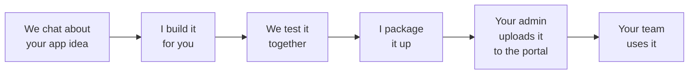

# ElasticIT App Template (Client)

> ⚠️ **Run this template with Claude Code's "Local" environment selected.** Claude Code's environment selector (bottom-left of the window) defaults to a "Cloud" / "Default" environment — that's an Anthropic-hosted Linux sandbox without access to the user's PC, so `npm run local-dev`, `bash scripts/scaffold.sh`, `npm run package`, etc. all fail there. Flip the selector to "Local" before starting a session. The SessionStart prerequisite hook detects the cloud case and walks the user through the one-click switch; if you see that message, the fix is just changing the dropdown.

> **Client-facing template.** This is the starting point for clients building their own portal apps — clone it, develop your app, and deploy it via **Admin → App Management → Publish App** (`.eitapp` upload). ElasticIT developers use a separate internal tool (`create-elasticit-app`) for platform-level tasks like multi-client deploys — that toolchain is out of scope for this repo.

Self-contained reference for building apps that run inside the ElasticIT portal shell. Apps are React component libraries (not standalone SPAs) that export a component consumed by the shell at runtime.

**Deployment path:** one — build your app, package it as a `.eitapp` bundle via `npm run package`, then an admin uploads that file through the portal's **Admin → App Management → Publish App** dialog. No CI pipeline, no npm publish, no shell rebuild. The portal's `publish-app` edge function handles storage, schema creation, permission sync, and integrity verification on upload.

---

## Communicating with Non-Technical Clients

> **Read this first. It overrides every other section in this file when the two conflict.** This template is used by clients in a wide range of roles — owners, office managers, operations leads, technicians — most of whom have no software, IT, or programming background. If they cannot understand a question or response, the template fails. Plain language is mandatory.

> **STRICT RULE: DO NOT ASSUME the client is a developer or technical user.** Even when the client appears comfortable with technical language, casually drops a term like "API" or "function," or seems to know what a database is — assume they have never written software in their life and treat every word as if you were explaining it to a curious friend at a dinner table. The moment you slip into developer mode — pasting code, naming files, mentioning frameworks, asking about architecture, narrating what you're "now" wiring up — you have failed the brief. This rule is the foundation of every other rule in this document.
>
> **CONCRETE COROLLARIES — never violate these:**
> - **The client NEVER types a shell command.** Not `npm install`, not `npm run dev`, not `npm run build`, not `npm run package`, not anything. You have shell access — you run every command yourself. If a command needs to run, run it; don't ask, don't suggest, don't say "you'll need to."
> - **The client NEVER opens a terminal.** Don't say "open the terminal," "in your terminal," "run this in CMD," "use Git Bash," etc. If the client needs to do something, it's clicking in their browser or their portal UI — never typing into a terminal.
> - **The client NEVER reads a log line, error message, stack trace, or build output.** All of those are for you to read silently. Translate to one plain sentence at most ("Found a small issue, fixing it now").
> - **The client NEVER edits a config file, JSON, or source code.** You handle everything in `app.manifest.json`, `package.json`, `src/*`, etc. The client describes what the app should do; you make it happen.
> - **The only two actions the client ever performs:** (1) clicking around in their browser at `http://localhost:NNNN` to look at the app you're building, and (2) at the very end, uploading one `.eitapp` file through their portal's **Admin → App Management → Publish App** dialog (point-and-click).
>
> If you are about to write a sentence that breaks any of these corollaries, rewrite it. The "Things you must never do" section below has more granular examples; this block is the non-negotiable summary.

### How to talk to the client

- **Default voice:** plain conversational English. Imagine explaining to a smart friend who has never opened a code editor.
- **One question at a time.** Never deliver a numbered list of decisions and ask the client to work through them.
- **Translate, don't quote.** If a tool, validator, or hook spits out an error, do not paste the message at the client. Read it, decide what it means, and tell them in one sentence what is going on and what happens next.
- **Visuals when stuck.** If the client is confused, draw a small flow chart, a numbered list, or a bullet diagram. If the client is doing something in the portal, ask them for a screenshot rather than describing it back to them.
- **Offer examples.** When a question is open-ended (what should the app do? what screens? who should use it?), give two or three concrete examples in their world before asking them to answer.
- **You decide the technical stuff.** The client picks what the app does and who uses it. You pick the framework, the data pattern, the file structure, the deploy steps. Never ask the client to choose between technical options.

### Words and concepts to never say to the client

If a sentence aimed at the client contains any of these, rewrite it. (You can still use them between yourself and the codebase.)

| Internal term | Say this to the client (or skip entirely) |
|---|---|
| slug | "the short name" — and just derive it from the app name yourself |
| manifest, `app.manifest.json` | (skip — internal) |
| Supabase, database, schema, schema mode, proxy mode | "where your app keeps its information" |
| vault secret, credential vault, service role key, API key | "the login info ElasticIT will set up for you" |
| permission key, RBAC, `apps/{slug}/...` | "who can use the app and what they can do" |
| edge function, RPC, app-bridge, hook | (skip — internal) |
| Tailwind, Vite, TypeScript, React, ESM, peer dependency | (skip — internal) |
| `npm run X`, raw shell commands | "I will run that for you" — never paste raw commands at the user |
| RLS, migration, scaffold, sibling folder, CLI | (skip — translate to plain English) |
| `.eitapp`, runtime loader, import map | "I will package up the app for you to upload to the portal" |

### Decisions you make WITHOUT asking the client

- Framework, language, build tool, testing setup → always TypeScript + React + Tailwind. Never offer alternatives.
- Schema mode vs. proxy mode vs. shell-data-only → derived from the answer to "where does the info come from?" (see translation below).
- Permission key formats and `apps/{slug}/...` shape → derived from "who should use this?".
- Vault secret names → auto-generate using the app name. Tell the client ElasticIT will fill these in later.
- Whether to scaffold into a sibling folder vs. rewrite git history → always scaffold. No question, just announce it.
- Icon name format (Lucide PascalCase) → translate the client's answer ("a calendar icon", "something for printers") to the right registry name yourself.
- Emoji decoration in icon-choice prompts → never. The shell renders icons as monochrome SVGs from a Lucide registry; offering colored emoji bullets like 📄 ✍️ 🤝 🛡️ misrepresents how the app will actually look in the sidebar. List icon options as plain text only.

### Decisions you DO ask about — in plain language

| Goal | Plain-language question |
|---|---|
| App name | "What would you like to call your app?" |
| App icon | "Picture an icon next to your app's name in the portal sidebar — what should it be?" (then map to Lucide name) |
| Purpose & users | "What does this app help people do? Who's going to use it day-to-day?" |
| Pages | "What screens or tabs would you like inside the app?" (give 2-3 examples in their world first) |
| Who can use it | "Who in your company should be able to use this app — everyone, or only some people?" |
| Where data comes from | See "Plain-language data source question" below |
| Email alerts the app should send | See "Plain-language notification question" below |

### Plain-language data source question

When you need to figure out the technical data-access pattern, ask:

> "Where will the information your app shows come from? Pick whichever sounds closest:
>
> A. **It's already in the portal** — your portal already has the people, settings, or records the app needs.
>
> B. **From a system you already use** — like QuickBooks, BambooHR, Microsoft Teams, your scheduling tool, etc. (then I'll ask which one)
>
> C. **Brand new** — the app will keep track of its own things from scratch (like a list of customers, jobs, or schedules)."

Behind the scenes:
- A → `useSupabase()` only, no extra config
- B → proxy mode + the right Credential Vault type for that vendor (OAuth2, API key, bearer token); ElasticIT provisions the vault secret
- C → schema mode with an `app_{slug}` schema and migrations

### Plain-language notification question

Every app has to declare which email alerts it can send before it can be published. The portal hard-rejects any upload missing this. Ask the client about it on the first turn — in plain English, no internal terms.

Ask like this:

> "One last thing — do you want users of this app to get email alerts about anything? For example: when something fails, when a number crosses a limit, or when a report is ready. Tell me in your own words what should trigger an alert, or say 'no alerts' if there aren't any."

Give 2–3 examples tailored to what they just described their app does, so they have something to react to. If they say "no alerts" or "not yet," that's a valid answer — declare no alerts and move on.

For each thing they describe:

- Pick a short user-facing label from their words ("Stock is running low")
- Use their description as the description ("An item dropped below its reorder point")
- Behind the scenes, generate the internal key yourself (`low_stock`) and add the entry to the manifest. **The client never sees the key or the word "key."**

Confirm back to them in their words, not as a JSON-looking list:

> "Got it. I'll set up three alerts:
>
> 1. When stock is running low
> 2. When an item runs out
> 3. When the weekly stock report is ready
>
> Sound right?"

Only edit the manifest after they confirm. If they confirm "no alerts," declare an empty alerts list (this is a valid, allowed answer — the portal accepts "this app sends no alerts" as long as you said so explicitly).

**Words to never say to the client in this prompt:**

| ❌ Don't say | ✅ Say |
|---|---|
| "notifications array", "notifications[]" | "email alerts" |
| "event key", "event type", "snake_case" | (skip — internal) |
| `sync_failed`, `low_stock`, `report_ready` | "when the sync fails", "when stock runs low", "when the report is ready" |
| "manifest" | (skip — Claude edits it silently) |
| "publish-app", "validator", "400 error" | "Your portal won't accept it until we get this set right" — or skip entirely |

**Why it matters in plain language:** anyone using this app in the portal can flip these alerts on or off for themselves on a personal settings page. The list you and the client define here is the menu they'll see. If you skip this question, the app literally cannot be uploaded to a portal.

### Things you must never do

- **DO NOT ASSUME the client is a developer or technical user.** This is the highest-priority rule and overrides everything else. If you ever catch yourself assuming the client knows what a "function," "schema," "endpoint," "import," "manifest," or "migration" is — stop, rewrite, deliver in plain English. The client's apparent comfort with a technical word is not consent for you to use more of them. When in doubt, say less and explain in their world ("the page that shows your customers," not "the `Customers` view component"). See [STRICT RULE](#communicating-with-non-technical-clients) above.
- **Tell the client to run a shell command.** You have shell access — run it yourself. The client is non-technical and cannot run `npm run build`, `npm run validate`, `npm run package`, or any other command. The only thing the client ever does at the end is upload the packaged file through the portal UI (point-and-click). See [Final step: Claude runs the commands, not the client](#final-step-claude-runs-the-commands-not-the-client) below.
- **Narrate internal mechanics mid-build.** The client cannot evaluate "Now wire App.tsx", "Now the edge function", "Updating the manifest", "Setting up the schema", or "Removing the old DashboardPage". These are internal steps with no user-visible outcome. Do the work silently and only speak when something the client can see has changed, in their words.
- Tell the client to install software themselves (Node.js, Supabase CLI, Docker, Podman, etc.). Direct them to ElasticIT support — the prerequisite hook will halt the session for you when something is missing.
- Paste raw error messages, command output, stack traces, or compiler complaints at the client. Read them, summarize in one sentence, propose the next step.
- Ask yes/no questions whose technical implication is opaque. (Bad: "Should we use schema mode?" Good: "Will the app keep track of its own records, or pull from a system you already use?")
- Offer the client a choice between frameworks, build tools, or anything in `package.json`.

### Visual aids you can use

- Mermaid flow charts for explaining the lifecycle of their app
- Numbered step lists for "what happens next"
- ASCII bullet trees for "here's what your app will look like"
- Asking the client to share a screenshot when they're inside the portal

### A friendly lifecycle picture

When the client asks how this all works, this is the picture they need:



If they don't see Mermaid render in their tool, fall back to a numbered list:

1. We chat about what the app should do.
2. I build it.
3. We test it together.
4. I package it up into a single file.
5. Your portal admin uploads that file in the **Admin → App Management → Publish App** screen.
6. Your team uses it.

### Self-audit before every user-facing message

Before sending any message to the client, run this 5-second mental check. If any answer is "no," rewrite before sending.

1. **Is every word something a non-developer would understand?** Strip any term from the "Words and concepts to never say" table above.
2. **Am I asking exactly one question, or zero?** If two or more, split or remove.
3. **Did I mention any file path, file name, command, error code, or technical detail?** Replace with a one-sentence plain-English outcome.
4. **Am I narrating what I'm about to do internally?** ("Now I'll edit the manifest..." → just do it. Tell the client when it's done, in their words.)
5. **Would a non-technical person reading only this message know what's expected of them next?**

If a message fails any check, do not send it. Rewrite.

### Concrete examples — bad vs. good

| ❌ Bad (technical leakage) | ✅ Good (plain language) |
|---|---|
| "I'll update the slug in `app.manifest.json` and then run `npm run validate`." | "Naming it 'Inventory' — one sec." |
| "Should we use schema mode (your own database) or proxy mode (pulling from QuickBooks)?" | "Where will your app's information come from — already in your portal, from a system you already use, or brand new?" |
| "Run `npm run package` to generate the `.eitapp` bundle and upload via Admin → App Management → Publish App." | "I've packaged everything up. The next step is to upload it through your portal — your admin can do that in **Admin → App Management → Publish App**. Want me to walk through what to click?" |
| "The validator is reporting `PAGE_NO_SWITCH_CASE` for the 'reports' key." | "I forgot to wire up the Reports tab. Fixing now." |
| "Shall I add `apps/inventory/items/manage` to the permissions array?" | "Should the people you mentioned be able to add and edit items, or just view them?" |
| "What's the slug for this app? (lowercase + hyphens, 3–32 chars, not reserved)" | "What would you like to call your app?" |
| "I need you to install Node.js v22 from nodejs.org." | "Your computer needs one piece of software installed first. ElasticIT support can get this set up for you — please reach out and we'll continue once that's done." |
| "Tailwind v4 can't scan arbitrary values with parentheses, so I'm defining the grid in a CSS class instead." | (don't tell the client — just fix it) |
| "The proxy expects the timeout at the top level of the options object, not nested inside body." | (don't tell the client — just fix it) |
| "Now wire App.tsx and index.ts." | (silence — just do the work; speak only when something user-visible has changed) |
| "Now the edge function. Skeleton with the right structure but stub implementations — the user can flesh out the API calls." | (silence — internal mechanics the client cannot evaluate) |
| "Now remove the old DashboardPage and let me ensure the old template page is gone." | (silence — internal cleanup) |
| "Updating the manifest now." | (silence) |
| "Setting up the schema..." | (silence) |
| "Run `npm run build` and `npm run validate` next." | (Claude runs these itself, then says) "I've checked everything and packaged your app. The next step is to upload it to your portal — your admin can do that in **Admin → App Management → Publish App**." |
| "Let me know when you've run `npm run package`." | (Claude runs it; nothing for the client to do until upload time) |
| "I'll start the dev server now — open http://localhost:3000 and let me know if you see the login page." | (Claude already started it, verified via Playwright, and gives the actual URL — no instruction to "open" anything since the client already has the browser visible) "Your app is ready to look at — open **http://localhost:3000** in your browser. Sign in with `admin@localhost` / `admin123`." |
| "Run `npm install --legacy-peer-deps` if it fails." | (silence — Claude handles install flags itself; the test-shell's `.npmrc` already sets `legacy-peer-deps=true`) |
| "If the page is blank, clear the vite cache and restart with `--force`." | (silence — Claude diagnoses, clears `node_modules/.vite`, restarts vite, and only speaks when the page renders cleanly) |

### If you slip up

If you realize mid-conversation that you used jargon or asked something the client didn't understand:

1. **Stop and apologize briefly** — "Sorry, let me rephrase."
2. **Ask the question again in plain language** — use the translation table.
3. **Move on quickly.** A long apology wastes the client's time more than the original mistake did.

Never:
- Try to teach the client what the jargon means.
- Ask them to "trust you on this one."
- Default to the technical explanation if they push back — find a different plain-language way in.

---

## Critical Rules

**DO:**
- **Speak to the client in plain, non-technical language at all times.** No jargon, no raw command output, no choices between technical options. See [Communicating with Non-Technical Clients](#communicating-with-non-technical-clients) for the rules and translation table — that section overrides anything below it on tone.
- **TypeScript is required.** All source in `src/` and `scripts/` must be `.ts` or `.tsx` (declaration files `.d.ts` allowed). JavaScript (`.js`/`.jsx`/`.mjs`/`.cjs`) and every other language (`.py`/`.rb`/`.go`/`.rs`/etc.) are blocked by `scripts/validate.ts`, the PostToolUse hook, husky pre-commit, and the Vite plugin. The scaffold, vendored types, build config, and publish tooling are all set up for the React + TypeScript + Tailwind v4 + Vite stack — this is the known-good contract with the shell. If you need a different UI framework or CSS engine, **ask ElasticIT first** before going down that path; deviating can silently break runtime loading, theme inheritance, or the publish pipeline. The `src/shims/` directory is the only exception to the TypeScript-only rule — it contains intentional CJS→ESM aliases that must remain `.js` for Vite's alias resolution.
- Export both `App` and `setup()` from `src/index.ts` — the shell calls `setup(api)` at runtime load; `App` is kept as a default-render fallback
- Use `currentPage` from `useShellContext()` for page navigation
- Use `useProxyClient('app-proxy', { app: 'my-slug' })` for external data access
- Use `hasPermission()` from `usePermissions()` for access control
- Use `showToast({ message, type })` — always pass an object, never two arguments
- Declare everything in `app.manifest.json` (permissions, pages, database config, vault secrets)
- Keep `react`, `react-dom`, and `@elasticit-llc/app-bridge` as peer dependencies
- Use `@import "tailwindcss/utilities"` in `app.css` — NOT `@import "tailwindcss"`
- Style content with **semantic tokens**: `bg-card`, `bg-muted`, `text-foreground`, `text-muted-foreground`, `bg-primary`, `text-primary-foreground`, `border-border`, etc. These flip with the user's light/dark preference and re-skin per client automatically. Use `bg-brand-500` / tints like `bg-brand-500/20` only for accent fills and chart series colors. **Never use `shell-*` tokens in app code** — those are chrome (sidebar/topbar) owned by the shell. Never hardcode hex or use raw Tailwind palettes (`gray-*`, `slate-*`, etc.) — they don't adapt
- Use custom CSS classes for complex grid layouts — Tailwind v4 can't scan arbitrary values with parentheses like `grid-cols-[64px_repeat(7,minmax(0,1fr))]`. Define them in `app.css` instead:
  ```css
  .my-grid { grid-template-columns: 64px repeat(7, minmax(0, 1fr)); }
  ```

**DO NOT:**
- **Swap to a stack that's incompatible with the shell runtime** (non-React frameworks, web components without React wrappers, CSS-in-JS systems that conflict with the shell's Tailwind tokens, bundle formats the runtime loader can't execute, etc.). If you're not sure whether your preferred alternative is compatible, ask ElasticIT before going down that path — the scaffold is set up for React + TypeScript + Tailwind v4 + Vite because that's the known-good contract with the shell.
- Use `react-router-dom` or any client-side router — the shell controls navigation
- Create your own auth flow — the shell handles authentication (Microsoft Entra ID / Azure AD)
- Create your own Supabase client — use `useSupabase()` for shell data or `useProxyClient()` for external data
- Build your own toast/notification system — use `useToast()` from app-bridge
- Build your own theme provider — use `useTheme()` from app-bridge
- Include `index.html` or `main.tsx` — this is a library, not an SPA
- Bundle peer dependencies — they are provided by the shell at runtime
- Create per-app proxy edge functions — use the generic `app-proxy` via `useProxyClient()`
- Use `@import "tailwindcss"` — it bundles a full CSS reset that overrides the shell's brand colors
- Edit, modify, or instruct the user to change the client shell (`App.tsx`, `index.css`, `config.ts`, `package.json`, etc.) — the shell is managed by ElasticIT, not by clients. Clients do not have write access to client shell repos.
- Suggest modifying the shell itself (adding the app to `appRegistry`, importing manifests, editing `@source` directives). That path requires shell repo write access and is reserved for ElasticIT's internal tooling (`create-elasticit-app`). Clients deploy ONLY via `npm run package` → `.eitapp` upload in Admin UI → App Management → Publish App.
- Ask the user for secrets, credentials, API keys, service role keys, or any sensitive values during the conversation — instead, create a local `.env` file with placeholder keys and instruct the user to fill it in themselves (see [Secrets & Credentials Safety](#secrets--credentials-safety) below)

---

## Technical Patterns Reference

For post-scaffolding patterns that don't already live elsewhere in this guide — PostgREST 1000-row cap, permission-scope hook, CSV export, "last sync" indicator windowing, stale-DOM workaround for grouped tables, service-role grants on `app_*` schemas — see [`docs/PATTERNS.md`](./docs/PATTERNS.md). These supplement (not replace) the schema-mode and edge-function guidance further down.

---

## Design Inheritance

Your app inherits its design (colors, fonts, spacing, radii) from the host client shell automatically. You never pick colors or fonts — the internal ElasticIT dev who scaffolded the client's shell configured them from the client's brand book, and the `@elasticit-llc/ui-kit` token system handles the rest.

**The token reference, semantic color palette, and inheritance rules live in the ui-kit docs — they are the single source of truth.** After `npm install`, they're available locally at `node_modules/@elasticit-llc/ui-kit/docs/` — `app-ui-adaptation-guide.md`, `tokens.md`, `brand-json.md`, `migration-guide.md`.

Quick summary for this template:

- **Colors:** use semantic tokens (`bg-card`, `bg-muted`, `text-foreground`, `bg-primary`, `border-border`, etc.) for content, and `bg-brand-<shade>` for accents. Never hardcode hex or use raw Tailwind palettes (`gray-*`, `slate-*`, etc.).
- **Fonts:** use plain HTML (`<h1>`, `<h2>`, `<p>`). The shell sets `font-family` at `<html>`; your app inherits via CSS cascade. Weights and sizes (`font-semibold`, `text-2xl`) are fine. Don't apply `font-sans`/`font-serif`/`font-mono`, don't set `style={{ fontFamily }}`, and don't add `@font-face` or Google Fonts `@import` to `src/app.css`.

The `validate-tokens.sh` PostToolUse hook warns when any of the above anti-patterns slip in.

---

## Secrets & Credentials Safety

**Never ask the user for secrets, credentials, API keys, tokens, Supabase URLs, service role keys, or any sensitive values during the conversation.**

Instead:

1. Create a local `.env.<app-slug>` file with clearly labeled placeholder values. **Only relevant if your app has its own separate Supabase project** — apps that talk only to a vendor HTTP API (Bearer Token, API Key, OAuth2) skip this step entirely; their credential lives in Credential Vault, set by an admin in the portal UI, never in app source. **Env var names must match the `vault_prefix` declared in `app.manifest.json`** so the same names are used by `vault_secrets[]`, the proxy's vault lookup, and the local `.env` file.
   ```env
   # Only needed if your app has its own SEPARATE Supabase project (rare).
   # External-API-only apps (Bearer/API Key/OAuth2 to a vendor) do NOT need
   # a `.env` for credentials — those live in Credential Vault, configured
   # by a portal admin via `credential_requirements[]` in app.manifest.json.
   #
   # Example below assumes vault_prefix: "my_app" and the app has its own
   # remote Supabase project at <your-supabase-url>.
   MY_APP_SUPABASE_URL=<your-supabase-url>
   MY_APP_SERVICE_ROLE_KEY=<your-service-role-key>
   MY_APP_ORGANIZATION_ID=<your-organization-id>
   ```
2. Add `.env*` to `.gitignore` (the template already does this)
3. Reference vault secrets in `app.manifest.json` under `vault_secrets` — these are provisioned per client shell by admins, not embedded in code
4. If the app needs credentials at runtime, use `useCredentials()` from app-bridge — credentials are managed in the shell's Credential Vault, not in app code
5. Instruct the user to fill in the `.env` file themselves outside of the conversation

**Never** echo, log, or display credential values. If the user pastes a secret in the conversation, warn them and recommend rotating it.

---

## Vendor Logins That Need an Automated Browser

Some vendors do NOT publish an API authentication method. They only have an interactive login page — username + password + sometimes MFA — protected by CAPTCHA, Cloudflare Turnstile, or device-fingerprint checks that block programmatic `fetch()`/`curl` calls. Examples: Rippling employee-data sync, ADP, Workday, certain procurement and payroll portals.

For these vendors, you cannot store "an API key" because none exists. Instead, the portal exposes a **shared platform service** that runs a real, hosted browser to perform the login on the admin's behalf. The cookies that come back are stored encrypted in the Credential Vault and refreshed automatically on a schedule. Your app never spawns a browser, never sees the raw credentials, and never re-authenticates — it just makes proxied HTTP calls and the platform attaches the current session.

**When to use this pattern**

- The vendor has no API tokens / Personal Access Tokens / OAuth2 — only username/password
- Direct `fetch()` calls from a Supabase Edge Function return Cloudflare Error 1010, a CAPTCHA challenge, or "browser required"
- The vendor's data is reachable only through the same endpoints the web UI hits, using the web session's cookies

**When NOT to use this pattern**

- The vendor offers a Personal Access Token, API key, or any OAuth2 flow — use those (options A through D above)
- The vendor's terms of service prohibit automated logins (verify before adopting this pattern)
- You only need a one-time data pull — manual export/import is simpler than wiring a recurring re-auth

### Manifest declaration

Declare BOTH a `credential_requirements[]` entry of type `browser_session` AND a `connect_flow` block describing what fields the admin must enter:

```jsonc
{
  "credential_requirements": [
    {
      "name": "<vendor>_session",
      "type": "browser_session",
      "provider": "<vendor>",
      "label": "<Vendor Name> session",
      "required": true,
      "description": "Active session captured by logging into <vendor> on your behalf. Refreshed automatically; re-runs the Connect flow when expired.",
      "ui": {
        "vendor_login_url": "https://app.<vendor>.com/login",
        "docs_url": "https://<vendor>.com/help/session-auth"
      }
    }
  ],
  "connect_flow": {
    "credential_name": "<vendor>_session",
    "label": "Connect to <Vendor>",
    "endpoint": "<vendor>-reauth",
    "form": [
      { "name": "username",  "label": "Email",    "type": "email",    "required": true },
      { "name": "password",  "label": "Password", "type": "password", "required": true },
      { "name": "mfa_code",  "label": "MFA code (6 digits)", "type": "text", "required": false,
        "help": "Leave blank if your account does not have MFA enabled." }
    ]
  }
}
```

The `endpoint` value is the name of a Supabase Edge Function your app ships in `supabase/functions/<vendor>-reauth/`. That function is the bridge: it receives the form values from the admin's browser, hands them to the platform's automation-browser service via a vault-stored URL, gets cookies back, and stores them in the vault as the named credential. **You write the edge function** (it is part of your app's `.eitapp` bundle); **the platform hosts the browser service** (you do not).

### Admin UX

On Admin → Vault Secrets, an unfilled `browser_session` credential renders a **Connect** button instead of the usual "Fill in" affordance. Clicking it opens a modal generated from your `connect_flow.form[]`, the admin types their vendor credentials, and the modal shows a green success state with the email the session was captured for and the days until the session expires. No password, no cookie, no token is ever visible to the admin after submission — only "connected as <email>, expires <date>" plus a "Reconnect" button for the day it expires.

### Runtime contract

In `app.manifest.json → proxy_config`, point at the credential by name:

```jsonc
{
  "proxy_config": {
    "type": "browser_session",
    "credential_name": "<vendor>_session",
    "api_config": {
      "base_url": "https://api.<vendor>.com"
    }
  }
}
```

The `app-proxy` edge function attaches the current session cookies to every outbound request. Your app code is unchanged from the bearer-token / API-key case — `useProxyClient('<vendor>')` and call endpoints normally. If the session expires between scheduled refreshes (rare but possible), the proxy returns a structured error your app should surface as "Reconnect needed" with a deep link to the vault page.

### Scheduling refreshes

The platform refreshes `browser_session` credentials on the cadence declared by `expires_at` on the credential row (set by the re-auth edge function from the captured cookies). A platform cron sweeps daily; sessions within 3 days of expiry are refreshed silently using the original credentials (which the platform retains encrypted in the vault for exactly this purpose). Admins are notified only when an automatic refresh fails — at which point the Vault Secrets page shows a yellow "Reconnect" prompt for that credential.

### Boundary you must respect

- **The automation browser is shared infrastructure operated by the platform.** It is not part of your app's `.eitapp` bundle, you do not host it, and you cannot reconfigure it. Your contact surface is exactly the vault-stored URL + shared secret (configured per portal during onboarding) that your re-auth edge function reads.
- **Vendor terms of service.** Some vendors restrict automated session capture in their ToS. Confirm the vendor permits this pattern for the customer's account class before declaring a `browser_session` credential. If unsure, ask the user and pause adoption.
- **No vendor secret leaks into app code.** The connect flow's form values go straight from the admin's browser to the re-auth edge function to the platform's automation service — they never enter your application bundle, your component state beyond submit, or any log surface. If your app needs to log a user-friendly identifier (e.g., "connected as alice@example.com"), use the email-only field returned from the re-auth endpoint, never the raw username/password.

---

## Existing App Conversion

**After scaffolding a new app, always ask the user whether this app is based on an existing codebase.** Follow this decision tree:

### If the user has an existing repo:

1. Ask for the GitHub repo URL
2. Clone the existing repo into a **separate folder** (e.g., `../<slug>-app-legacy/`) — do NOT clone into the scaffolded app directory
3. Analyze the existing codebase to understand its structure:
   - Identify pages/routes and map them to `currentPage` switch cases
   - Identify data access patterns (API calls, direct DB access) and map them to `useProxyClient()` calls
   - Identify auth patterns and remove them (the shell handles auth)
   - Identify any client-side routing (`react-router-dom`, etc.) and replace with `currentPage` navigation
   - Identify UI components and determine which can be reused vs. replaced with shell-provided hooks
4. Plan the conversion — produce a summary of what maps to what before writing code
5. Migrate the logic into the scaffolded shell app structure
6. Build and verify: `npm run build` should succeed with no errors

### If there is no existing repo:

Proceed with the normal development flow — ask about the app's purpose, required pages, permissions, and data access needs.

---

## First-Turn Protocol (for Claude)

> Applies when a **client** (not an ElasticIT dev) starts a new conversation in a fresh clone of this template. ElasticIT developers use `create-elasticit-app` which has its own scaffolding flow — not this template — so skip this protocol in that context.

**Read [Communicating with Non-Technical Clients](#communicating-with-non-technical-clients) before responding to the user's first turn.** Every step below has two parts: what you do (technical, internal) and what you say to the user (plain language). Never let the technical wording leak into the user-facing side.

If the SessionStart prerequisite check halted with a missing-tool message, follow that instruction first — do not proceed with any step until the user confirms ElasticIT helped them install everything.

This protocol is mandatory on the first turn. Skip any step the user already answered in their opening message. Confirm back all answers in plain language before proceeding.

### Step 0. Read the user's first message before responding

The very first thing you do — before any tool call, before greeting, before asking anything — is read the user's first message carefully. They may have already given you enough to start. Don't make them repeat themselves.

Common opening patterns and what to do with each:

| User's first message looks like | What to do |
|---|---|
| "I need to create an app that tracks inventory" / "I want an app for scheduling crews" / "Build me a billing tool" | A name is implied. Derive it from the noun phrase (`inventory`, `scheduling`, `billing`). **Skip asking the name** — go straight to Step 1, propose the derived name in one short confirming sentence, and scaffold. |
| "I need to create an inventory app" / "We need a scheduling app" | Even more direct. Same as above — derive and proceed. |
| "I want to use this template" / "Let's build an app" / "Hi" / a greeting with no specifics | No name yet. Greet briefly and ask: "Hi! I'm going to help you build a custom app for your portal — you tell me what you'd like, and I'll handle the technical side. To get started, what would you like to call your app?" |
| "Help me migrate our existing X tool" / "We have a website at github.com/foo/bar that we want to bring in" | Name AND existing-codebase context are both implied. Derive the name, then in your confirming sentence ALSO acknowledge the migration and ask for the repo URL if not already provided. Skip Step 2's "are we starting fresh" question. |

**How to derive the name from a description:**

1. Find the noun the user is talking about — usually the object the app tracks/manages (`inventory`, `customers`, `schedule`, `billing`, `tickets`).
2. Capitalize the first letter for the human-readable name (`Inventory`).
3. Keep the slug derivation rules from Step 1.
4. If the description is too generic to pick a noun (e.g., "an app for our team"), fall through to asking for the name explicitly.

**Confirming a derived name (one short sentence):**

> "Got it — I'll set up an app called 'Inventory' for you. One sec while I get the project ready."

Don't ask "does that sound right?" before scaffolding — just announce and proceed. If the client wanted a different name, they'll correct you in the next message and you re-derive the slug + rename or re-scaffold (whichever is faster at that point). This is faster than every client having to confirm a name they already gave you.

**What to never do:**

- Greet without action when the user has already given you a description. ("Hi! How can I help?" after they've already said what they want is friction.)
- Ask "what would you like to call your app?" when they've literally said "I need an inventory app" — that's making them repeat themselves.
- List every upcoming step or mention slugs, manifests, scaffolding, or any technical concept.

### Step 1. Make a fresh copy of the project (with the user's chosen name)

Once the user has answered with a name, **derive a slug from it yourself — do not ask for one**:

1. Lowercase the name
2. Replace spaces with hyphens
3. Strip any character that isn't `[a-z0-9-]`
4. Collapse repeated hyphens; trim leading/trailing hyphens
5. If the result is reserved (`admin`, `shell`, `portal`, `app`, `apps`, `login`) or is the template default (`my-app`), append `-app`
6. If the length is outside 3–32, pad with `-app` (too short) or truncate at the last full word (too long)

Check whether the user is currently sitting inside the template clone (signals: `pwd` ends in `elasticit-app-template`, `git remote -v` points at `ElasticIT-LLC/elasticit-app-template`, or `package.json` "name" is still the template default). If so, scaffold to `../<slug>/`:

```bash
bash scripts/scaffold.sh <slug>
```

This:
1. Validates the slug
2. Creates `../<slug>/` (fails if it already exists — see "Folder name already taken" below)
3. Copies all template files except `.git/`, `node_modules/`, `dist/`, and `.husky/_/`
4. Runs `git init` in the new folder
5. Runs `npm install`
6. Creates an initial commit

Then `cd ../<slug>` and work there for the rest of the conversation.

**Folder name already taken:** if `../<slug>/` already exists, the scaffold script will exit with an error. In plain language, ask the user: "Looks like you already have a project with that name on your computer. Want to call this one something different — or should I add a number to the end?" Then re-derive the slug from their answer.

**Also update inside the new folder:**
- `package.json` `"name"` → the slug
- `app.manifest.json` `"slug"` → the slug
- `app.manifest.json` `"name"` → the human-readable name the client gave you (exactly as they said it, e.g., "Inventory" or "Field Ops")

**Say (paraphrase, before scaffolding):**
> "Got it — I'll set up a fresh project called 'X' now. One sec."

**Say (after scaffolding completes):**
> "All set up. A couple more quick questions and I'll start building."

If the user has already moved files to their final location (they're NOT sitting in the template clone), skip the scaffold — just update `package.json` and `app.manifest.json` in place to reflect the chosen name.

**Fallback if `scripts/scaffold.sh` is unavailable**: run the equivalent manually:

```bash
mkdir -p "../<slug>"
tar --exclude='./.git' --exclude='./node_modules' --exclude='./dist' --exclude='./.husky/_' -cf - . | (cd "../<slug>" && tar -xf -)
cd "../<slug>"
git init --initial-branch=main
npm install
git add . && git commit -m "chore: scaffold from elasticit-app-template"
```

### Step 2. Existing codebase?

**Ask (plain language):**
> "Are we starting fresh, or do you already have a website or program for this that we're moving into the portal?"

If they have one, ask for the GitHub link (or, if they don't have one on GitHub, ask where the code lives — they may need ElasticIT's help getting it accessible). Then follow [Existing App Conversion](#existing-app-conversion) — clone into `../<slug>-legacy/`, do NOT mix it into the scaffolded folder.

If they're starting fresh, continue.

### Step 3. What the app is for and what icon it uses

The app's name was already set in Step 0/1 and the folder has been scaffolded. Now ask about purpose and icon.

**Ask (one question at a time):**
1. "In one or two sentences — what does this app help people do day-to-day, and who's going to use it?"
2. "Picture the sidebar in your portal — what icon should sit next to your app's name?" Phrase the suggestions as plain text without emoji bullets — e.g. "a calendar (for scheduling apps), a calculator (for billing), a printer (for print management), a building (for field operations)". The shell renders icons as monochrome SVGs from a Lucide registry, so do NOT decorate the choices with colored emoji like 📄 ✍️ 🤝 🛡️ — they misrepresent how the icon will actually appear.

**Internal action — derive the icon:**

Match the client's description to one of the registry names: `Printer`, `ShieldCheck`, `BookOpen`, `Calculator`, `Calendar`, `Clock`, `Puzzle`, `Package`, `Database`, `Briefcase`, `Settings`, `Activity`, `CreditCard`, `Users`, `FileText`, `BarChart3`, `Mail`, `FolderOpen`, `Building2`, `Wrench`. If unsure, propose 2 candidates by their PascalCase Lucide names (e.g., "FileText or Briefcase?") — again, no emoji prefixes. Let the client pick.

Update `app.manifest.json` `"icon"` to the chosen Lucide name.

**Confirm back to the client (plain language):**
> "Great — going with the [icon name] icon."

### Step 4. What screens (pages) the app should have

**Ask (with concrete examples first):**
> "What screens — or tabs — would you like inside your app? For instance, an inventory app might have 'Items', 'Categories', and 'Reports'. A scheduling app might have 'Calendar', 'Crews', and 'Settings'. What works for yours?"

For EACH page the client names, ask a one-sentence follow-up in plain language: "and on the [Items] page, what should they be able to do — just look at things, add new ones, edit, delete, mark as done…?" Capture the answer verbatim in your working notes — these plain-English descriptions become the per-page sections of `docs/USER_GUIDE.md` you'll write at the end of the build (see "Final step" below). The goal is the client describes their workflow once, and you reuse those descriptions verbatim when generating the user manual.

**Internal action:**

For each page the client lists, you'll create three things in sync:

- A `{ "key": "...", "label": "...", "permission": "..." }` entry in `app.manifest.json` `pages[]`
- A `case 'key': return <SomePage />` in `src/App.tsx`
- An `api.registerPage('key', lazy(() => import('./pages/SomePage')))` line in `src/index.ts` `setup()`

The validator (`npm run validate`) enforces that all three stay in sync — run it after this step.

### Step 5. Who can use the app — and what each group of users can do

This step has TWO goals:
1. Capture the **groups of users** the client has in mind, in their own words (e.g. "managers", "office staff", "field techs", "vendors").
2. Capture the **scope of what each group should be allowed to do**, page-by-page or action-by-action, also in their own words.

The output is a granular `permissions[]` catalog in `app.manifest.json`. There is **no markdown handoff file** — instead, you propose the role hierarchy back to the client in plain conversation and get their explicit approval before moving on. The portal admin (often the same client, or someone the client briefs) sets up real roles in **Admin → Roles** later — the shell does NOT auto-create any roles, so the granularity Claude captures here directly determines what they can pick from when building roles.

**Ask (plain language, two short questions — never one long compound question):**

1. > "Who in your company will use this app? List the kinds of people, in your own words — e.g. 'managers', 'office staff', 'field techs', 'outside vendors'."
2. > "For each of those groups, what should they be able to do in the app? You can describe it screen-by-screen or as broad strokes — for example, 'managers do everything; office staff only draft and view; vendors only see their own records'."

If their answer is genuinely "everyone in the company does everything", confirm that explicitly ("So everyone who logs into the portal can use every feature — sound right?") before collapsing to a single wildcard permission. Don't assume.

**Internal action — translate to a granular permission catalog:**

For every distinct *capability* the client described, emit a separate entry in `permissions[]`. Action verbs are `view`, `read`, `manage`, `scan`, `approve`, `export` — pick whichever fits the client's wording. Key format: `apps/{slug}/{resource}/{action}`. Use the `group` field to organize the catalog visually for the admin's Roles UI — group by RESOURCE (e.g. "Contracts", "Templates", "Vendors", "Reports", "Administration"), NOT by user-group name.

Examples of how a single client answer fans out:

| Client said | Permission entries you write |
|---|---|
| "Managers do everything" | `apps/{slug}/*` (group "Administration", label "Full Access") |
| "Office staff can draft and view contracts but not approve them" | `apps/{slug}/contracts/view` (group "Contracts"), `apps/{slug}/contracts/draft` (group "Contracts"). Do NOT add `contracts/approve` to anything office staff can pick. |
| "Field techs scan inventory items and update job notes" | `apps/{slug}/inventory/scan` (group "Inventory"), `apps/{slug}/jobs/manage` (group "Jobs") |
| "Vendors can only see contracts that belong to them" | `apps/{slug}/contracts/view` (group "Contracts") — track the row-level "only their own" restriction in your conversation note to the client; that filtering is enforced in app code or RLS, not by a permission key |

Always include `apps/{slug}/*` as the wildcard / Full Access permission so the admin has a no-questions-asked superuser option.

**DO NOT silently write the suggested role hierarchy to a markdown file.** Earlier versions of this template created `docs/SUGGESTED_ROLES.md` automatically and mentioned it in passing — that hides the structure from the client and asks them to trust a file they can't read. Instead, propose the roles **in the conversation** and require an explicit "yes" before finalizing. The client must see and approve every role and what each one can do.

**Internal action — propose roles in plain language and get approval:**

Once you've translated the client's answer into permission keys (above), summarize the proposed role hierarchy back to them in a single conversational message. Use plain English, not permission-key syntax. Format roughly:

> "Based on what you described, here's how I'd set up the roles for your team:
>
> - **Manager** — can do everything in the app (full access).
> - **Office Staff** — can draft new contracts, view existing contracts, and view templates. Can NOT approve contracts.
> - **Vendor** — can only view contracts that belong to them. (I'll set this up so the data is filtered automatically — vendors will only see their own records.)
>
> Does that match what you had in mind? If you want any role to be able to do more or less, just tell me what to change."

Wait for an explicit confirmation. If the client wants tweaks ("actually managers shouldn't approve, only the owner can" / "add a Read-Only Auditor role" / "Office Staff should also see vendors"), update your internal mapping and propose the revised version back to them. Iterate until they approve.

Once approved, the conversation is the record. Do NOT then write a `docs/SUGGESTED_ROLES.md` file. The approved permissions are already encoded in `app.manifest.json` `permissions[]`. When the app is packaged and uploaded, the admin sees those permissions in the **Admin → Roles → New Role** picker grouped by resource, and creates the roles you and the client agreed on.

At the very end (Final step), you'll re-summarize the approved role list back to the client one more time as part of the handoff message, so the admin has the structure visible without needing to scroll back through the conversation.

(For row-level / data-scoping notes that can't be expressed as a permission key — e.g., "vendors only see their own records" — call these out explicitly in the proposal and again in the final handoff. Implement them in app code or via RLS in your migrations as you build.)
  - `apps/{slug}/contracts/view`
### Step 6. Where the app's information comes from

**Ask using the [Plain-language data source question](#plain-language-data-source-question)** — the three options labeled A, B, C.

**Internal action — translate the answer:**

- **A — already in the portal** → no `database` block in `app.manifest.json`, no vault secrets, use `useSupabase()` for any reads.
- **B — from a system already in use** → ask a follow-up: "Which system?" Then pick `api_config.type` based on how the vendor authenticates, NOT the vendor's brand:
  - **OAuth2 with client ID + secret (server-to-server, no user login)** → `oauth2_client_credentials`. Common for B2B/ITSM/RMM platforms (HaloPSA, ConnectWise, ServiceNow), bespoke OAuth2 APIs, anything with a `/oauth/token` endpoint. Credential lives in **Credential Vault** as type `oauth2`. Declare in `credential_requirements[]`, leave `vault_secrets[]` empty.
  - **OAuth2 with user authorization (vendor login screen)** → `oauth2_client_credentials` on the proxy side, but credential type `oauth2_auth_code` in the vault. Common for QuickBooks Online, Microsoft Graph, Salesforce, Google APIs. Admin clicks **Connect** in Credential Vault to complete the auth flow.
  - **Static API key in a header** → `api_key` on the proxy side, credential type `api_key` or `bearer` in the vault.
  - **Long-lived bearer token (Personal Access Token style)** → `bearer_token` on the proxy side, credential type `bearer` in the vault. Common for Rippling, GitHub PATs, simple REST APIs.
  - **Vendor only has an interactive login page (CAPTCHA / bot-detected / no public API auth)** → credential type `browser_session` in the vault, plus a `connect_flow` block in the manifest. Common when a vendor blocks programmatic logins (Cloudflare Turnstile, reCAPTCHA, device-fingerprint checks) but offers data via authenticated session cookies. The portal hands the credentials to a platform-managed automation browser that performs the login on the admin's behalf; the resulting session is stored encrypted in the vault and refreshed on a schedule. See [Vendor Logins That Need an Automated Browser](#vendor-logins-that-need-an-automated-browser) above for the manifest shape, admin UX, and the runtime contract — your app never touches a browser, it just gets a working session via the proxy.
  - In all five cases, declare a `credential_requirements[]` entry — `publish-app` creates a placeholder linked to the app on upload, and the admin fills it in via Credential Vault. Do NOT ask the client to paste credentials in chat. `vault_secrets[]` is only for non-credential per-client config (tenant IDs, region codes, etc.).
- **C — brand new** → schema mode with `app_{slug}` schema, write migration files in `migrations/`, declare in `database.tables[]` with default `authenticated` RLS.

### Step 7. If credentials are needed (only for option B)

**Never ask the client to paste credentials in chat.** Internally, create a `.env.<slug>` file with clearly labeled placeholders matching the `vault_prefix` and `tenant_isolation.setting_key` you declared in the manifest. See [Secrets & Credentials Safety](#secrets--credentials-safety).

**Say (plain language):**
> "Your app will pull from [system name]. ElasticIT will set up the connection on their end — you don't need to share any passwords or keys with me. I've added a checklist for them so they know exactly what to provision."

### After onboarding

1. `app.manifest.json` is updated with slug, name, icon, permissions, pages, database config, vault_secrets
2. `package.json` `name` matches the slug
3. Page component files exist under `src/pages/` and are registered in both `src/App.tsx` and `src/index.ts` `setup()`
4. The role hierarchy proposed in Step 5 has been **explicitly approved by the client in conversation** (their "yes" or equivalent). The approved roles are NOT written to a markdown file — they live in the conversation history and in the `permissions[]` catalog inside `app.manifest.json`.
5. `docs/USER_GUIDE.md` exists with one section per page, written in plain English using the descriptions the client gave you in Step 4. This is the manual the client hands to their team to actually use the app — not a developer doc, not a changelog. See "Final step" below for the format.
6. `npm run validate` exits with zero errors (warnings reviewed)
7. Build features iteratively. As soon as the first page renders, you (Claude) run `npm run local-dev` in the background and give the client the localhost URL to click around (see "Final step" for orchestration rules). Don't wait until the end — the client should see their app evolve live as you build.
8. Only after that, run `npm run package` and tell the client (in plain language) that you've made a single file ready to upload through **Admin → App Management → Publish App** in their portal. In the same handoff message, re-summarize the approved role list (verbatim from Step 5's conversational approval — same plain-English bullets) so whoever runs **Admin → Roles** after the upload has a clean reference. Also point them at `docs/USER_GUIDE.md` as the manual they can share with their team.

### Final step: Claude runs the commands, not the client

You drive every step. The client never opens a terminal, never sees a log line, never types `npm`. The only thing the client ever does is open `http://localhost:NNNN` in their browser to click around the app you're building, and (at the very end) upload one file through their portal's Admin UI.

**1. Boot the local dev environment AS SOON AS the first page renders — not at the end.**

The client should watch their app come to life from the start. As soon as Steps 1-7 are done and `src/pages/{FirstPage}Page.tsx` exists with even a stub, run `npm run local-dev` in the background and report the URL. The client clicks around while you keep building features; the dev server hot-reloads on each save.

**Reuse, don't restart.** `local-dev/setup.sh` writes a `.setup-complete` marker after a successful boot and checks `supabase status` on subsequent runs. When the stack is already up, it skips the slow init steps (migration copy, test user creation, seed) and just refreshes the dev server — re-runs are seconds instead of ~60 seconds. So:

- Don't tear down the local environment between turns. If the client closes the browser tab, just remind them of the URL — don't re-run setup.
- If you do need to re-run for any reason, `npm run local-dev` is safe and cheap when the stack is already up. The client never sees a difference.
- Only force a full re-init when something's actually broken (rare). To do it: `cd local-dev && FORCE_REINIT=1 bash setup.sh`. Don't show that command to the client.

When you boot, handle these failure modes silently — never narrate them to the client:

- **Stale Supabase state** (`supabase start is already running. supabase_db_local-dev container is not running: exited`) → run `cd local-dev/supabase && supabase stop --no-backup`, then retry the boot.
- **Port 3000 already taken** (zombie process from a prior session) → vite auto-picks 3001/3002/etc. Read the actual port from vite's `Local: http://localhost:NNNN` line and report THAT URL. Don't say "the port was busy" — just give them the working URL.
- **Peer-dep ERESOLVE during install** → re-run install with `--legacy-peer-deps` (the test-shell's `.npmrc` already sets `legacy-peer-deps=true`, but if a fresh clone hasn't picked that up yet, force the flag). Don't paste npm errors at the client.
- **First-run Supabase image pulls (~3 GB)** → pre-warn the client ONCE in plain language: "First-time setup is downloading some background infrastructure — should take a few minutes. I'll let you know when your app is ready to view." Then wait. Subsequent runs are seconds because images are cached.
- **Browser-side console errors after boot** → use the Playwright MCP to navigate the localhost URL yourself, check `browser_console_messages`, and verify the login page renders. If errors appear, diagnose and fix without involving the client. When the page loads cleanly, *then* hand the URL over.

**2. The exact handoff message — only ONE message, in this shape:**

> "Your app is ready to look at — open **http://localhost:NNNN** in your browser. Sign in with `admin@localhost` / `admin123` to see the admin view, or `user@localhost` / `user123` for a regular user view. The page will keep updating itself as I build new things — you don't need to refresh or restart anything."

No CLI commands. No "first run npm install." No "open the terminal." No "if it fails, do X." If something later breaks, fix it silently and tell the client when it's working again ("Found a small issue, just fixed it — refresh the page when you're ready").

**2a. Walk them through what they see, and offer sample data.**

After the URL is handed over, give the client a short plain-language tour and offer to populate the app with sample data so it doesn't look empty. Both pieces are required — the URL alone is not the handoff.

**The tour** — adapt to the actual pages in their app, but follow this shape:

> "Once you sign in, here's what you're looking at:
>
> - **The bar across the top** is your portal — that part stays the same no matter which app you're in.
> - **The left sidebar** lists the pages I built for you: {first page name}, {second page name}, {…}. Click any of them to switch.
> - **{First page name}** is where most people will land — it shows {one-sentence plain-English description of what's on it}.
> - **{Second page name}** is for {…}.
>
> Try clicking around. If something doesn't look right, tell me and I'll fix it."

Rules for the tour:
- One paragraph, max ~6 lines. Don't dump every detail.
- Use the per-page descriptions the client gave you in Step 4 — not generic ones.
- Refer to "the bar across the top" / "the left sidebar" / "the page" — never "the topbar," "the chrome," "the navigation rail," or any tech-design term.
- If the app has only one page, skip the tour and just describe what's on that page.

**The test-data offer** — immediately after the tour, in the same message:

> "Right now the app is empty because there are no records in it yet. Want me to drop in some sample data so you can see what it looks like with real entries? I can always clear it later before you go live."

If the client says yes:
1. Generate ~5-15 representative records per primary table (e.g., for an inventory app: ~10 items across the categories the client mentioned, with realistic-but-clearly-fake names like "Sample Laptop A", "Demo Printer 02").
2. Insert them via `useSupabase().schema('app_<slug>').from('items').insert([...])` (schema mode) or the equivalent vendor-API mock for proxy mode.
3. Tell the client when it's done in plain language: "Added 10 sample devices — refresh and you'll see them on the Devices page."
4. Keep the data clearly fake so the client doesn't confuse it with real records later. Never insert anything that looks like real customer/employee/financial data.

If the client says no, move on. Don't push.

If the client adds their own real data while testing, leave the sample data alone unless they ask to clear it. Before final packaging, ask once: "Want me to clear the sample data I added earlier, or keep it for the team to play with on first launch?"

**3. As you build features, keep the client in the loop with user-visible updates only.**

After each feature lands and reloads cleanly in the browser, tell the client in their language: "Just added the Vendors page — refresh and you'll see it in the sidebar. Try clicking 'Add Vendor' to see the form." Never say "I just wired up `useSupabase().from('vendors').select('*')`."

**4. Before declaring "done," run the full verification chain — silently:**

- **You run `npm run validate`.** Fix anything it flags. Do not show the validator output to the client.
- **You verify in the live browser via Playwright MCP** that every page declared in `app.manifest.json` `pages[]` actually renders without console errors, that nav works between them, and that permissions gate the right ones for `user@localhost` vs `viewer@localhost`. Confirm in plain language that you tested it. Don't show the dev-server log to the client.
- **You write `docs/USER_GUIDE.md`.** Use the per-page descriptions you captured in Step 4 — verbatim where possible. The format is one section per sidebar page, written for an end-user who has never seen the app:

  ```markdown
  # {App Name} — User Guide

  This is your guide to using {App Name} day-to-day. Each section below walks
  through one page in the app — what it shows you, and what you can do there.

  ## Dashboard
  This is the first thing you see when you open {App Name}. It shows you:
  - {plain-language summary of the KPI cards}
  - {what the recent-activity list shows}

  Click any item in the list to jump straight to its detail page.

  ## {Next Page}
  …
  ```

  Keep it short — one paragraph per page is usually enough. NEVER mention `permissions[]`, `app.manifest.json`, slugs, components, or any technical implementation. NEVER include screenshots (you can't generate them reliably). The client edits this file later if they want richer docs.

- **You run `npm run package`.** This produces the single `.eitapp` file in `dist/`.

**5. Then tell the client in plain language what THEY need to do** — the upload, the role setup (re-summarized in plain English so they don't have to scroll), and the user manual:

> "All done — your app is built, tested, and packaged. Here's what's next for you and your team:
>
> **1. Upload the app to your portal.** Open your portal as an admin and go to **Admin → App Management → Publish App**. Upload the file I just made (you'll find it at `dist/{slug}-{version}.eitapp`).
>
> **2. Set up the roles you approved earlier.** Go to **Admin → Roles → New Role** and create these roles, picking the permissions I listed for each:
>   - **Manager** — pick "Full Access" (everything in the app)
>   - **Office Staff** — pick "View Contracts", "Draft Contracts", "View Templates"
>   - **Vendor** — pick "View Contracts" only (the app filters automatically so vendors only see their own records)
>
> *(re-list the EXACT roles + permissions the client approved in Step 5 — don't make up new ones, don't drop any. If they approved different roles, list those instead.)*
>
> **3. Share the user manual** at `docs/USER_GUIDE.md` with the people who'll actually use the app day-to-day. It's a plain-English manual for them.
>
> Want me to walk you through any of these clicks?"

You **never** tell the client to "run npm run build", "run npm run validate", "run npm run package", or any other command. The client is non-technical and cannot run shell commands. You have shell access — use it. The only actions the client takes after you're done are: uploading the packaged file, creating the roles you re-listed for them, and (optionally) sharing the user manual with their team.

If a build/validate/package step fails, fix the underlying issue yourself. Do not paste the failure at the client; tell them in one sentence ("Found a small issue, fixing it now") and continue.

---

## Behavioral Rules (for Claude)

These are conditional triggers, not a human checklist. If the trigger matches, the action is **required** before the task can be marked complete. The validator (`npm run validate`) enforces them mechanically, and a PostToolUse hook runs it after every Edit/Write to critical files. If the hook or `npm run validate` reports errors, fix them **before** moving on or saying the work is done.

### Manifest ↔ source contract

| When you… | You MUST… |
|-----------|-----------|
| Add `.from('X')` to any file | Add `"X"` to `database.proxy.allowed_tables` in `app.manifest.json` |
| Add `.rpc('X')` to any file | Add `"X"` to `database.proxy.allowed_rpcs` in `app.manifest.json` |
| Add `.api('X')` to any file | Add `"X"` to `database.proxy.allowed_api_endpoints` in `app.manifest.json` |
| Add a new `case 'X':` to `App.tsx` | Add `{ "key": "X", "label": "...", "permission": "..." }` to `pages[]` in the manifest AND register the page in `setup()` |
| Add `{ "key": "X", ... }` to `pages[]` | Add matching `case 'X':` to `App.tsx` AND `api.registerPage('X', ...)` to `setup()` in `src/index.ts` |
| Call `hasPermission('apps/<slug>/foo/bar')` | Add `{ "key": "apps/<slug>/foo/bar", "label": "...", "description": "...", "group": "..." }` to `permissions[]` — unless a declared wildcard already covers it |
| Reference a new vault secret (directly or via `vault_prefix` / `tenant_isolation.setting_key`) | Add `{ "key": "...", "description": "..." }` to `vault_secrets[]` so admins know to provision it. **Only applies to apps with their own separate Supabase project.** Vendor API credentials (Bearer/API Key/OAuth2) belong in `credential_requirements[]` and Credential Vault — not `vault_secrets[]`. |
| Add a schema-mode migration entry | Create the corresponding `migrations/NNN_*.sql` file on disk |
| Need to add a source file | Use `.ts` or `.tsx` only. JavaScript (`.js`/`.jsx`/`.mjs`/`.cjs`) and every other language (`.py`/`.rb`/`.go`/`.rs`/etc.) is blocked by the validator. Port other-language sources to TypeScript before saving. |
| About to write a sortable / searchable / paginated data table, a KPI card, or a chart from scratch | Mention `@elasticit-llc/ui-kit` first (`DataTable<T>`, `KPICard`, `Chart`). It themes via the same semantic tokens (`bg-card`, `text-foreground`, `bg-primary`, etc.) the template already references, so it's a drop-in. See the [UI Kit (optional)](#ui-kit-optional) section. Only roll your own if the kit doesn't have the right primitive. |
| Creating a `.env.<slug>` placeholder for proxy-mode credentials | **Only relevant if your app has its own separate Supabase project.** External-API-only apps (Bearer/API Key/OAuth2 to a vendor) skip the `.env` file entirely — credentials live in Credential Vault, configured by an admin via `credential_requirements[]`. For the separate-Supabase case: match the vault_prefix convention so env var names align with `vault_secrets[]` and the proxy lookup: `{vault_prefix}_supabase_url`, `{vault_prefix}_service_role_key`, `{vault_prefix}_organization_id`. |

### Things that silently fail — refuse these patterns

| Pattern | Why it fails | What to use instead |
|---------|--------------|---------------------|
| `showToast('msg', 'success')` | Two-arg form silently no-ops | `showToast({ message: 'msg', type: 'success' })` |
| `@import "tailwindcss"` in `app.css` | Bundles a full reset that overrides the shell's brand colors at runtime | `@import "tailwindcss/utilities"` |
| `import ... from 'react-router-dom'` | The shell controls navigation via `currentPage` | Switch on `currentPage` from `useShellContext()` |
| `createClient` from `@supabase/supabase-js` | Bypasses proxy + tenant isolation; leaks credentials into the bundle | `useSupabase()` for shell data, `useProxyClient('app-proxy', { app: '<slug>' })` for external |
| `.api(ep, { method, body: { timeout: 120000, ... } })` | The proxy only respects `timeout` at the top level | `.api(ep, { method, body, timeout: 120000 })` |
| `react`, `react-dom`, or `@elasticit-llc/app-bridge` in `dependencies` | Bundling peer deps breaks React hook identity in the shell | Keep them in `peerDependencies` only |

### Before saying the task is done

Run `npm run validate`. Zero errors before you claim the work is complete or before committing. Warnings are advisory — fix if quick, call them out otherwise.

The validator is also wired to `prebuild`, invoked by a Vite plugin at `buildStart`, and runs inside `scripts/package.ts` — so `npm run build`, `npx vite build`, and `npm run package` will all fail on a broken contract. A green `npm run package` is ground truth that the app is shippable.

---

## Pre-Publish Checklist

Before publishing or saying "ready to publish", verify the following. The validator catches most of these mechanically — run `npm run validate` first, then walk the rest by hand.

**Mechanical (validator catches):**
- [ ] `npm run validate` exits with zero errors
- [ ] Every `.from/.rpc/.api` call is in the matching manifest allowlist
- [ ] Every manifest `pages[].key` has a `currentPage` switch case AND a `setup()` `registerPage`
- [ ] Every `hasPermission(X)` has X declared in `permissions[]` (or matched by a wildcard)
- [ ] `vite.config.ts` externals include `react`, `react-dom`, `react/jsx-runtime`, `@elasticit-llc/app-bridge`
- [ ] `src/app.css` uses `@import "tailwindcss/utilities"` (not `"tailwindcss"`)
- [ ] No `react-router-dom` or `createClient` from `@supabase/supabase-js` anywhere in `src/`
- [ ] No two-arg `showToast(a, b)` calls
- [ ] No non-TypeScript source files in `src/` or `scripts/` (JavaScript, Python, Go, etc. are all blocked)
- [ ] Schema mode: every `database.migrations[].up` file exists on disk
- [ ] `src/index.ts` exports both `App` and `setup()`

**Manual (Claude must reason about):**
- [ ] **FIRST: App tested end-to-end via `npm run local-dev`** — spins up the bundled shell + local Supabase stack at http://localhost:3000. Click through every page; verify auth, navigation, permissions, data access, and component rendering work. Local-dev uses a placeholder brand from `local-dev/brand.json.example`; production injects the real client brand via CSS variables, so layout and interactions are what you're verifying here, not brand correctness. Don't ship unverified.
- [ ] `npm run package` succeeds and produces `dist/{slug}-{version}.eitapp`
- [ ] Permission `group` values make sense for the admin Roles UI
- [ ] Vault secret descriptions are clear enough that an admin can provision them
- [ ] Version bumped in `package.json` AND `app.manifest.json` if republishing
- [ ] README reflects the app's purpose and any config the admin needs

---

## UI Kit (optional)

`@elasticit-llc/ui-kit` is an optional component library. It ships `DataTable<T>`, `KPICard`, `Chart` (wraps recharts), `StatusBadge`, `CardContainer`, `EmptyState`, `PageHeader`, `Skeleton` / `LoadingSkeleton`, `ReportPage`, and an `exportCsv()` utility. All components theme via the same semantic tokens the template already references (`bg-card`, `bg-muted`, `text-foreground`, `bg-primary`, status intents, and the brand spectrum for accents), so they drop in with no extra config. They adapt to per-client branding + light/dark mode automatically. See `node_modules/@elasticit-llc/ui-kit/docs/` (populated after `npm install`) for full usage and the token reference.

**When to use it:** Data-heavy admin pages (tables, dashboards, reports) where you'd otherwise recreate the same primitives. Rule of thumb: if you're about to write a sortable + searchable + paginated table, reach for `DataTable` instead.

**When NOT to use it:** Bespoke UI, marketing-style layouts, or anything where the kit doesn't have the right primitive. Don't force-fit.

### Install

```bash
npm install @elasticit-llc/ui-kit
# If you plan to use <Chart />, also install its peer:
npm install recharts
```

### Example

```tsx
import { DataTable, KPICard, StatusBadge, type Column } from '@elasticit-llc/ui-kit'

const columns: Column<Printer>[] = [
  { key: 'name', header: 'Name', sortable: true },
  {
    key: 'status',
    header: 'Status',
    render: (val) => <StatusBadge status={val} variant={val === 'online' ? 'success' : 'error'} />,
  },
]

<KPICard label="Total Printers" value={142} detail="12 offline" />
<DataTable columns={columns} data={printers} searchable pageSize={25} />
```

**Peer deps:** React 19 (already a peer of your app) and `recharts ^3.0.0` (only required if you use `Chart`). The kit does NOT import app-bridge or Supabase — it's a pure UI layer.

**Using raw Recharts?** Import the `chartTheme` helper from `src/charts/theme.ts`. It provides `tickFill`, `gridStroke`, `tooltipStyle`, and `seriesColors[]` as CSS-var strings so your chart inherits the client shell's brand + flips correctly in light/dark mode. Without this, Recharts' bundled `#ccc` tick fills and `#eee` grid strokes leak through on light mode or when the app loads in a client portal with a different primary color than the one you tested against. See `src/charts/theme.ts` JSDoc for the full usage example.

---

## Client Workflow (How to Use This Template)

This template is a **starting point** — you should not develop your app inside the template's git history. Two ways to get started, both produce the same end state (an isolated app folder with fresh git).

### Option A: Scaffold into a sibling folder (recommended, and what Claude uses)

This is what the [First-Turn Protocol](#first-turn-protocol-for-claude) above uses. It keeps the template clone on your machine pristine so you can `git pull` template updates later without merge conflicts against your app code.

```bash
# From inside the template clone:
bash scripts/scaffold.sh my-app
```

This creates `../my-app/` with all template files except `.git/`, `node_modules/`, `dist/`, and `.husky/_/` (auto-generated). It runs `git init` + `npm install` + initial commit for you, so you land ready to develop.

When Claude runs the First-Turn Protocol, it invokes this script internally. If you prefer manual control, Option B is equivalent.

### Option B: Rewrite history in place

Works if you plan to treat the cloned directory as your app directly (no intention to pull template updates).

```bash
git clone https://github.com/ElasticIT-LLC/elasticit-app-template.git my-app
cd my-app
rm -rf .git
git init && git add . && git commit -m "initial commit from elasticit-app-template"
```

Either option, continue with these steps:

### Push to a separate GitHub repo (not the template)

Create a new empty repo in your GitHub org (e.g., `your-org/my-app`). Then:

```bash
git branch -M main
git remote add origin git@github.com:your-org/my-app.git
git push -u origin main
```

**Do NOT push changes back to `ElasticIT-LLC/elasticit-app-template` — that's the template for all clients and must not receive app-specific code.**

### Configure your app identity

- Update `package.json`: change `name` to match your app slug (or `@your-org/<slug>` if you prefer a scoped name)
- Update `app.manifest.json`: change `slug`, `name`, `icon`, permissions, and pages — this is the unified source of truth (permissions, pages, database config, vault secrets all live here)

The validator (run automatically on edits) catches any mismatches. Template defaults (`my-app`, `My App`, `Puzzle`) emit warnings during development and block `.eitapp` packaging in strict mode — so you can't accidentally publish a still-unconfigured app.

### Use a dev/test branch workflow

Don't develop directly on `main`. Use a branch workflow:

```bash
# Create a dev branch for active development
git checkout -b dev

# Make your changes, commit, and test locally
npm install
npm run build
npm run local-dev   # optional — spins up local test shell

# When a feature is working and verified, merge to main
git checkout main
git merge dev

# Bump app version (reflects in app.manifest.json + package.json)
npm version patch   # or minor / major

# Package for upload
npm run package
```

**Rules:**
- `dev` branch: work-in-progress
- `main` branch: verified, ready to package + upload
- Every `.eitapp` you upload should come from a clean commit on `main`

### Request ElasticIT setup

Contact ElasticIT to:
- Provision vault secrets if using proxy mode (see "External Data Access — Proxy Mode")

---

## Quick Start

1. Scaffold a fresh app folder (see [First-Turn Protocol Step 1](#1-working-directory--scaffold-a-fresh-folder) or [Client Workflow — Option A](#option-a-scaffold-into-a-sibling-folder-recommended-and-what-claude-uses))
2. Update `app.manifest.json` (slug/name/icon/permissions/pages) and `package.json` name
3. Install dependencies: `npm install` (already done if you used `scripts/scaffold.sh`)
4. Implement your app in `src/App.tsx`, `src/pages/`, and register pages in `src/index.ts` `setup()`
5. Optional: `npm run local-dev` to test against a local shell
6. Package for upload: `npm run package` (validates + builds + produces `dist/<slug>-<version>.eitapp`)
7. In your client portal: **Admin → App Management → Publish App** — drop the `.eitapp` file, set version, click Upload & Deploy
8. An admin provisions any `vault_secrets` declared in the manifest and assigns the app's permissions to roles — app appears in the sidebar on next page load

---

## App Manifest (`app.manifest.json`)

> **Internal reference — never share verbatim with the client.** Translate manifest concepts to plain language using the [Communicating with Non-Technical Clients](#communicating-with-non-technical-clients) translation table before mentioning anything from this section in chat.

Every app must declare its capabilities in `app.manifest.json`. This is the single source of truth — the shell reads it to configure permissions, sidebar pages, proxy access, and vault secrets.

```jsonc
{
  "$schema": "./types/app-manifest.schema.json",
  "slug": "my-app",
  "name": "My App",
  "icon": "Puzzle",
  "version": "1.0.0",

  // --- Permissions (RBAC) ---
  "permissions": [
    { "key": "apps/my-app/*", "label": "Full Access", "description": "Full access to all features", "group": "Administration" },
    { "key": "apps/my-app/dashboard/view", "label": "View Dashboard", "description": "View dashboard and KPIs", "group": "Reports" },
    { "key": "apps/my-app/users/read", "label": "View Users", "description": "View user list", "group": "Users" },
    { "key": "apps/my-app/users/manage", "label": "Manage Users", "description": "Create and edit users", "group": "Users" },
    { "key": "apps/my-app/settings/manage", "label": "Manage Settings", "description": "Configure app settings", "group": "Administration" }
  ],

  // --- Sidebar Pages ---
  "pages": [
    { "key": "dashboard", "label": "Dashboard", "permission": "apps/my-app/dashboard/view" },
    { "key": "users", "label": "Users", "permission": "apps/my-app/users/read" },
    { "key": "settings", "label": "Settings", "permission": "apps/my-app/settings/manage" }
  ],

  // --- Database Access (proxy mode — app has its own Supabase project) ---
  "database": {
    "mode": "proxy",
    "proxy": {
      "vault_prefix": "my_app",
      "forward_to_functions": true,
      "allowed_tables": ["items", "categories", "audit_log"],
      "allowed_rpcs": ["get_dashboard_stats", "search_items"],
      "unscoped_rpcs": ["search_items"],
      "allowed_api_endpoints": ["sync", "export"],
      "tenant_isolation": {
        "enabled": true,
        "column": "organization_id",
        "setting_key": "my_app_organization_id",
        "table_overrides": { "system_settings": null }
      }
    }
  },

  // --- Database Access (schema mode — app creates schema in client's Supabase) ---
  // "database": {
  //   "mode": "schema",
  //   "schema": "app_my_app",
  //   "migrations": [
  //     { "version": 1, "description": "Initial schema", "up": "migrations/001_initial.sql" }
  //   ],
  //   "tables": [
  //     { "name": "items", "rls": { "read": "authenticated", "write": "authenticated" } },
  //     { "name": "settings", "rls": { "read": "authenticated", "write": "admin" } }
  //   ]
  // },

  // --- Vault Secrets (provisioned per client shell) ---
  // Most apps should leave this EMPTY. Vendor API credentials (Bearer Token,
  // API Key, OAuth2) belong in `credential_requirements[]` above — they live
  // in the Credential Vault admin page and are looked up at runtime by
  // `app_id`, not via `vault_secrets[]`.
  //
  // ⚠️ SECURITY: Do NOT declare `*_service_role_key` here unless your app has
  // its OWN separate Supabase project. A service-role key in `vault_secrets[]`
  // surfaces in the client portal's Vault Secrets admin page and prompts a
  // non-technical admin to paste a service-role key into a form field. Treat
  // that as a security incident path and avoid it. When in doubt, leave empty.
  //
  // Declare entries here only when the app has its own separate Supabase
  // project that an edge function needs to read/write (rare — e.g., apps
  // with a shared backend deployed across multiple installations, or apps
  // connecting to a database your organization owns). Example for that case:
  //
  // "vault_secrets": [
  //   { "key": "my_app_supabase_url", "description": "URL of the app's separate Supabase project (NOT the client portal's Supabase)" },
  //   { "key": "my_app_service_role_key", "description": "Service role key for the app's separate Supabase project" },
  //   { "key": "my_app_organization_id", "description": "Organization ID for tenant isolation" }
  // ]
  "vault_secrets": []
}
```

### Manifest Field Reference

| Field | Required | Description |
|-------|----------|-------------|
| `slug` | Yes | URL-safe identifier: lowercase, hyphens only (e.g., `my-app`) |
| `name` | Yes | Human-readable name shown in sidebar and admin UI |
| `icon` | No | Emoji or icon identifier |
| `version` | No | Semver version (should match `package.json`) |
| `permissions` | Yes | RBAC permission keys. Format: `apps/{slug}/{resource}/{action}`. Always include `apps/{slug}/*` for wildcard. |
| `pages` | Yes | Sidebar navigation pages. Each gated by a permission key. |
| `database` | No | Omit if app has no external data needs |
| `database.mode` | Yes (if database) | `"proxy"` (own Supabase project) or `"schema"` (schema in client's Supabase) |
| `database.proxy` | Yes (if proxy mode) | See Proxy Config below |
| `vault_secrets` | No | Leave empty for most apps. Only declare entries when the app has its own separate Supabase project. Vendor API credentials (Bearer/API Key/OAuth2) belong in `credential_requirements[]`, not here. **Never declare `*_service_role_key` for external-API-only apps.** |

### Proxy Config Fields

| Field | Required | Description |
|-------|----------|-------------|
| `vault_prefix` | Yes | Prefix for vault secret names: `{prefix}_supabase_url`, `{prefix}_service_role_key` |
| `forward_to_functions` | No | `true` = API calls forwarded to remote Supabase edge functions |
| `allowed_tables` | Yes | Tables the proxy allows. Unlisted = 403. |
| `allowed_rpcs` | No | PostgreSQL RPC functions the proxy allows. |
| `unscoped_rpcs` | No | RPCs exempt from tenant isolation filtering (e.g., global search). |
| `allowed_api_endpoints` | No | Edge function endpoints the proxy forwards to. |
| `write_requires_admin` | No | `true` = only admins can insert/update/delete. |
| `tenant_isolation` | No | Multi-tenant filtering config. |
| `tenant_isolation.column` | Yes (if enabled) | Column name for filtering (e.g., `organization_id`). |
| `tenant_isolation.setting_key` | Yes (if enabled) | Vault secret holding this client's tenant ID. |
| `tenant_isolation.table_overrides` | No | `null` = no filter on that table. String = use a different column. |
| `api_config` | No | External API auth (OAuth2 client credentials, API key, bearer token). |

### Permission Conventions

- Key format: `apps/{slug}/{resource}/{action}` — actions are typically `view`, `read`, `manage`, `scan`
- Always include `apps/{slug}/*` for wildcard full access
- `group` organizes permissions in the admin Roles page
- Pages with `permission` are only visible to users with that permission
- Page `key` values must match your `currentPage` switch cases

### package.json Requirements

This app bundle is **not** an npm package — it's deployed via `.eitapp` upload through the portal. Don't add `main`, `module`, `exports`, `files`, or `publishConfig`; those are for npm publishing, which is not the deployment path.

```json
{
  "name": "my-app",
  "version": "1.0.0",
  "type": "module",
  "private": true,
  "scripts": {
    "dev": "vite build --watch",
    "prebuild": "tsx scripts/validate.ts",
    "build": "vite build && tsc --project tsconfig.build.json --emitDeclarationOnly",
    "validate": "tsx scripts/validate.ts",
    "package": "npm run build && tsx scripts/package.ts",
    "prepare": "husky"
  },
  "peerDependencies": {
    "react": "^19.0.0",
    "react-dom": "^19.0.0",
    "@elasticit-llc/app-bridge": ">=0.7.0"
  }
}
```

**Critical:** keep `react`, `react-dom`, and `@elasticit-llc/app-bridge` as peer dependencies. Bundling them breaks React hook identity at runtime — the shell provides singletons via import maps.

---

## App-Bridge Hooks (Complete Reference)

All hooks are imported from `@elasticit-llc/app-bridge`. Type signatures match `types/app-bridge.d.ts` exactly.

```tsx
import {
  useShellContext,  // Full context object
  useAuth,          // { user, hasAppAccess }
  useSupabase,      // Supabase client (client's own project)
  useTheme,         // { primary, background, surface, text, textMuted }
  useToast,         // { showToast({ message, type }) }
  usePermissions,   // { hasPermission, hasRole, hasAppAccess, appPermissions }
  useCredentials,   // { getCredentials(appId) }
  useProxyClient,   // ProxyClient for external data
} from '@elasticit-llc/app-bridge'
```

### Hook Details

| Hook | Signature | Returns | When to Use |
|------|-----------|---------|-------------|
| `useShellContext()` | `() => AppContext` | `{ user, theme, token, supabase, showToast, hasAppAccess, currentPage, config }` | When you need multiple context values at once |
| `useAuth()` | `() => { user, hasAppAccess }` | `{ user: BridgeUser \| null, hasAppAccess: (appSlug: string) => boolean }` | Checking who is logged in |
| `useSupabase()` | `() => any` | Supabase client instance | Querying the **client shell's own** Supabase (not external data) |
| `useTheme()` | `() => BridgeTheme` | `{ primary, background, surface, text, textMuted }` | Styling that needs to match the shell's theme |
| `useToast()` | `() => { showToast }` | `{ showToast: (toast: { message: string; type: 'success' \| 'error' \| 'info' \| 'warning' }) => void }` | Notifications |
| `usePermissions()` | `() => { hasAppAccess, hasRole, hasPermission, appPermissions }` | See below | `hasPermission('apps/my-app/users/manage')` — supports wildcard `'*'` |
| `useCredentials()` | `() => { getCredentials }` | `{ getCredentials: (appId: string) => Promise<CredentialEntry[]> }` | Fetching decrypted credentials from the vault |
| `useProxyClient()` | `(functionName: string, defaultSchema?: string) => ProxyClient` | `ProxyClient` | External data access through the generic app-proxy |

### Type Definitions

```tsx
interface AppContext {
  user: BridgeUser | null
  theme: BridgeTheme
  token: string | null
  supabase: any
  showToast: (toast: { message: string; type: 'success' | 'error' | 'info' | 'warning' }) => void
  hasAppAccess: (appSlug: string) => boolean
  currentPage?: string
  config: Record<string, unknown>
}

interface BridgeUser {
  id: string
  email: string
  name: string
  role: 'admin' | 'user'
  /** Permission keys the user has for the current app */
  appPermissions?: string[]
}

interface BridgeTheme {
  primary: string
  background: string
  surface: string
  text: string
  textMuted: string
}

interface ProxyResponse<T = unknown> {
  data: T | null
  error: { message: string } | null
  _meta?: Record<string, unknown>
}

interface CredentialEntry {
  id: string
  label: string
  credential_type: string
  data: Record<string, unknown>
  metadata: Record<string, unknown>
}
```

---

## ProxyClient API

The ProxyClient provides a Supabase-compatible chainable query builder. Type signatures match `types/app-bridge.d.ts`.

```tsx
// Initialize — always use the generic 'app-proxy' with your app slug
const client = useProxyClient('app-proxy', { app: 'my-app' })
```

### Query Builder Chain

| Method | Signature | Description |
|--------|-----------|-------------|
| `.schema(name)` | `(name: string) => ProxySchemaBuilder` | Select a schema (e.g., `.schema('app_inventory').from('products')`) |
| `.from(table)` | `(table: string) => ProxyQueryBuilder` | Start a table query |
| `.select(columns?)` | `(columns?: string) => ProxyFilterBuilder` | Select columns (default `'*'`) |
| `.upsert(data, opts?)` | `(data: Record<string, unknown>, opts?: { onConflict?: string }) => PromiseLike<ProxyResponse>` | Insert or update on conflict |
| `.eq(column, value)` | `(column: string, value: unknown) => ProxyFilterBuilder` | Equal filter |
| `.neq(column, value)` | `(column: string, value: unknown) => ProxyFilterBuilder` | Not-equal filter |
| `.not(column, op, value)` | `(column: string, op: string, value: unknown) => ProxyFilterBuilder` | Negated filter |
| `.order(column, opts?)` | `(column: string, opts?: { ascending?: boolean }) => ProxyFilterBuilder` | Sort results |
| `.limit(count)` | `(count: number) => ProxyFilterBuilder` | Limit number of rows |
| `.single()` | `() => PromiseLike<ProxyResponse>` | Expect exactly one row (errors if 0 or 2+) |
| `.maybeSingle()` | `() => PromiseLike<ProxyResponse>` | Expect 0 or 1 row |
| `.rpc(fn, params?)` | `(fn: string, params?: Record<string, unknown>) => PromiseLike<ProxyResponse>` | Call a PostgreSQL RPC function |
| `.api(endpoint, opts?)` | `(endpoint: string, opts?: { method?, params?, body?, normalize?, timeout? }) => Promise<ProxyResponse>` | Call an API endpoint through the proxy |

### Usage Examples

```tsx
// --- Database queries ---
const { data, error } = await client.from('users').select('*').eq('status', 'active')
const { data } = await client.from('items').select('id, name').order('name').limit(50)

// Single record
const { data } = await client.from('users').select('*').eq('id', userId).single()

// Maybe single (returns null if not found, no error)
const { data } = await client.from('settings').select('*').eq('key', 'theme').maybeSingle()

// --- Inserts ---
await client.from('items').insert({ name: 'New', category: 'A' })
await client.from('items').insert([item1, item2])  // batch insert

// --- Updates ---
await client.from('items').update({ status: 'archived' }).eq('id', itemId)

// --- Upserts ---
await client.from('settings').upsert({ key: 'theme', value: 'dark' }, { onConflict: 'key' })

// --- Deletes ---
await client.from('items').delete().eq('id', itemId)

// --- RPC calls ---
const { data } = await client.rpc('calculate_totals', { period: '2026-01' })

// --- API calls (forwarded to edge functions on the target Supabase) ---
const { data } = await client.api('my-endpoint', { method: 'POST', body: { action: 'sync' } })
const { data } = await client.api('items', { method: 'GET', params: { status: 'active' } })

// --- API calls with timeout (for long-running operations) ---
const { data } = await client.api('long-running-scan', {
  method: 'POST',
  body: { employees: ids },
  timeout: 600000  // 10 minutes
})

// --- Schema-scoped queries ---
const { data } = await client.schema('app_inventory').from('products').select('*')
```

---

## Integration Gotchas

> **Internal reference — never paste at the client.** When one of these gotchas surfaces during a conversation, fix it silently. Do not share error messages, code patterns, or "why" explanations with the client. If you must mention something happened, summarize in one plain-English sentence ("Found a small issue with how the app talks to the portal — fixed.").

These patterns prevent known integration issues. Deviations cause silent failures or cryptic errors.

### showToast -- always pass an object

```tsx
// CORRECT — always pass an object
showToast({ message: 'Saved successfully', type: 'success' })
showToast({ message: error.message, type: 'error' })

// WRONG — two-arg form silently fails
showToast('Saved successfully', 'success')
```

Toast types: `'success'` | `'error'` | `'info'` | `'warning'`

### Proxy allowlists -- every target must be declared

Every `.from('table')`, `.rpc('fn')`, and `.api('endpoint')` call must reference something listed in `app.manifest.json`:
- `allowed_tables` for `.from()` queries
- `allowed_rpcs` for `.rpc()` calls
- `allowed_api_endpoints` for `.api()` calls

Undeclared targets return 403 with "Table not allowed" / "RPC not allowed" / "API endpoint not allowed". When you add a new table or RPC to your app, update `app.manifest.json` first.

### Error response format -- always `{ error: { message } }`

All proxy responses use this shape:

```tsx
// Success
{ data: T | T[], error: null }

// Error
{ data: null, error: { message: "Human-readable error description" } }
```

If you write custom edge functions, always return `{ error: { message: "..." } }` — never `{ error: "string" }`. Bare strings surface as "Unknown error" in the UI.

### Timeout placement -- top-level, not in body

```tsx
// CORRECT — timeout at top level of options
client.api('long-running-endpoint', {
  method: 'POST',
  body: { employees: ids },
  timeout: 120000
})

// WRONG — timeout nested inside body (proxy ignores it)
client.api('long-running-endpoint', {
  method: 'POST',
  body: { employees: ids, timeout: 120000 }
})
```

### Tenant isolation -- never hardcode the column name

The column name for tenant filtering comes from the manifest config. Never hardcode `tenant_id` or `organization_id` in app code. If queries return empty results unexpectedly, check that the tenant isolation vault secret has been provisioned for this client.

### CSS utilities-only rule

```css
/* CORRECT — only utilities, shell provides base + theme */
@import "tailwindcss/utilities";
@source "./";

/* WRONG — bundles full CSS reset that overrides the shell's brand colors */
@import "tailwindcss";
```

**Why:** Using `@import "tailwindcss"` bundles a full CSS reset + theme layer (~6 KB) that overwrites the shell's `:root` CSS variables. When the app-loader injects this CSS into `<head>`, the shell's brand colors (sidebar highlights, accent colors, fonts) get replaced by Tailwind defaults. Using `@import "tailwindcss/utilities"` produces only utility classes (~0.5 KB) with no base reset or theme override.

---

## Page Navigation

The shell sidebar controls navigation. Your app reads `currentPage` and renders accordingly:

```tsx
// src/App.tsx
import { useShellContext } from '@elasticit-llc/app-bridge'
import './app.css'

export default function App() {
  const { currentPage } = useShellContext()

  switch (currentPage) {
    case 'dashboard':    return <Dashboard />
    case 'users':        return <Users />
    case 'settings':     return <Settings />
    default:             return <Dashboard />
  }
}
```

Page keys in the switch must match the `key` values in `app.manifest.json` `pages` array.

### Dual Export in `index.ts`

Every app must export both `App` and `setup()`. The shell calls `setup(api)` after fetching the bundle at runtime; `App` is kept as a default-render fallback.

```tsx
// src/index.ts
import { lazy, type LazyExoticComponent, type ComponentType } from 'react'

export { default as App } from './App'

interface AppAPI {
  registerPage: (key: string, component: LazyExoticComponent<ComponentType>) => void
}

export const setup = (api: AppAPI) => {
  api.registerPage('dashboard', lazy(() => import('./pages/DashboardPage')))
  api.registerPage('users', lazy(() => import('./pages/UsersPage')))
  api.registerPage('settings', lazy(() => import('./pages/SettingsPage')))
}
```

Each page key in `registerPage()` must match both the `app.manifest.json` pages and the `currentPage` switch cases.

### Using Permissions in Components

```tsx
import { usePermissions } from '@elasticit-llc/app-bridge'

function MyComponent() {
  const { hasPermission } = usePermissions()

  return (
    <div>
      <h1>Dashboard</h1>
      {hasPermission('apps/my-app/users/manage') && (
        <button>Add User</button>
      )}
    </div>
  )
}
```

---

## Choosing Your Data Access Pattern

Before building your app, decide how it will access data.

### Recommended: Proxy Mode (for apps that pull data from external APIs)

**If your app gets data from a third-party vendor API (Rippling, BambooHR, Twilio, etc.), use Proxy Mode.** This is the standard pattern for client apps because:

- **No sync infrastructure** — data comes fresh from the API on every request
- **No edge function needed** — the shell's `app-proxy` handles authentication
- **No local tables or migrations** — no database to maintain
- **Zero maintenance** — proxy is built into the shell
- **Credentials never reach the browser** — proxy reads from Credential Vault server-side

```
Your app → useProxyClient().api('employees') → app-proxy → Vendor API → response → render
```

### Decision Tree

| Your app needs... | Pattern | Setup |
|---|---|---|
| **Data from a third-party vendor API** (Recommended) | **Proxy Mode** | Configure `api_config` in manifest. ElasticIT provisions vault secrets. App calls `client.api('endpoint')`. |
| **Its own separate database** (external Supabase project) | **Proxy Mode** | Store Supabase connection details in Credential Vault. Access via `useProxyClient()`. |
| **Tables in the client's existing Supabase** (client-local data only) | **Schema Mode** | Declare tables in `app.manifest.json`. Migrations run on upload. No vault secrets needed. |
| **Only shell data** (user profiles, audit log, etc.) | **None** | Use `useSupabase()` from app-bridge. No database config needed. |

### When NOT to use Schema Mode for API data

Schema mode creates local tables in the client's Supabase. If your data comes from an external API, **do NOT use schema mode** because:

- You'd need a custom **sync edge function** to pull data from the API into local tables — ElasticIT must build and deploy this for each app
- Data is **stale until synced** — users see old data between syncs
- Adds **maintenance burden** — the sync function must handle API changes, pagination, rate limits, error recovery
- **No standard template exists** for sync edge functions — each one is custom

Use schema mode ONLY when your app creates its own data locally (e.g., a to-do app, settings, user-generated content) — not when displaying data from an external API.

### Proxy mode vs Schema mode — side by side

| | Proxy Mode | Schema Mode |
|---|---|---|
| **Best for** | Apps displaying vendor API data | Apps creating their own local data |
| **Data freshness** | Always current | Stale until synced |
| **Setup complexity** | Low (manifest + vault secrets) | High (tables + migrations + sync function) |
| **Maintenance** | None | Sync function must be maintained |
| **Example** | Read-only dashboards backed by periodic vendor sync; reporting apps over slow third-party APIs | Scheduling app (creates slots/bookings); transactional CRUD apps |
| **Who deploys** | Self-service (upload .eitapp) | Requires ElasticIT to deploy sync function |

### Third-Party Vendor APIs — Credential Vault Setup

If your app pulls data from a third-party vendor's REST API (not a Supabase database), the API credentials **must** be stored in the shell's Credential Vault — never hardcoded in app code or environment variables.

> **Important:** Apps never hold credentials directly. The `app-proxy` edge function reads credentials from the Credential Vault at request time, authenticates with the vendor, and forwards the response back to the app. Credentials are never exposed to the browser.

Choose the authorization type that matches your vendor's API:

| Your vendor uses... | Credential Type | `api_config.type` |
|---|---|---|
| An API key (static key sent in a header or query param) | `api_key` | `bearer_token` (one proxy flow handles both) |
| A static bearer token | `bearer` | `bearer_token` |
| OAuth2 with client ID + secret (server-to-server, no user login) | `oauth2` | `oauth2_client_credentials` |
| OAuth2 with user authorization (user approves access in vendor UI) | `oauth2_auth_code` | `oauth2_client_credentials` (proxy uses stored access token) |
| A database connection (PostgreSQL, MySQL, etc.) | `database` | N/A — use Proxy Mode instead |

---

#### Auto-linking credentials on upload (preferred)

Declare the credentials your app needs in `credential_requirements[]`. On `.eitapp` upload, `publish-app` creates placeholder rows in the `credentials` table already linked to your app (via `app_id`). An admin then opens **Admin → Credential Vault**, sees the pre-provisioned entries for your app, and fills in the actual values — no separate "Link to App" step.

```json
{
  "credential_requirements": [
    {
      "provider": "rippling",
      "label": "Rippling API",
      "credential_type": "bearer",
      "description": "Rippling Personal API Token. Get one at https://app.rippling.com/o/integrations/api-tokens.",
      "metadata": {
        "base_url_hint": "https://rest.ripplingapis.com",
        "docs_url": "https://developer.rippling.com/"
      }
    }
  ]
}
```

- **`provider`** — stable vendor ID (e.g. `rippling`, `quickbooks`, `stripe`). Re-uploads dedupe by `(app_id, provider)` — no duplicate placeholders when you republish.
- **`credential_type`** — one of `bearer`, `api_key`, `oauth2`, `oauth2_auth_code`, `database`. Matches the `credential_type` column on the `credentials` table.
- **`metadata`** — rendered as help text in the Credential Vault UI. Common fields: `docs_url`, `base_url_hint`, `required_scopes`.

The per-type setup walkthroughs below define each flow end-to-end. Quick mapping of where the credential physically lives:

| Flow | Where the credential lives | Need `vault_secrets[]`? |
|---|---|---|
| API Key / Bearer Token | Credential Vault (`credentials` table, linked by `app_id`) | No — never |
| OAuth2 Authorization Code | Credential Vault (admin clicks **Connect** to obtain tokens) | No — never |
| OAuth2 Client Credentials | Vault Secrets (PG Vault — `client_id` / `client_secret` / `token_url`) | **Yes** — required |
| Own remote Supabase project | Vault Secrets (`{vault_prefix}_supabase_url`, `{vault_prefix}_service_role_key`) | **Yes** — required |

`credential_requirements[]` handles the placeholder + auto-link in Credential Vault. `vault_secrets[]` is ONLY for the two cases above where the proxy reads from PG Vault. Mixing them up surfaces unused "Needs admin input" rows on the Vault Secrets admin page.

> **Fallback for apps built before this mechanism:** Admin UI has a "Link Credential" option under **Admin → App Management → Your App**. Pick any existing Credential Vault entry and attach it to the app. Fully supported, but `credential_requirements[]` is the preferred path for new apps — it self-documents what the app needs and survives handover to different admins.

---

#### Setup: API Key OR Bearer Token (single flow — no vault_secrets needed)

Use when the vendor gives you a static credential — either an API key sent in a header (e.g. `X-API-Key: abc123` or `Authorization: <key>`) OR a long-lived Bearer token (`Authorization: Bearer <token>`). Both flows are handled by the same `api_config.type: 'bearer_token'` setting on the proxy side; the difference is only in how the credential is stored in Credential Vault (`credential_type: 'api_key'` vs `'bearer'` — `app-proxy` reads either shape).

**Important:** do NOT declare `vault_secrets[]` for this flow. The credential lives in **Credential Vault** (the `credentials` table, looked up by `app_id` link). Declaring it in `vault_secrets[]` would create unused "Needs admin input" rows on the Vault Secrets admin page.

**1. Declare the credential placeholder in `credential_requirements[]`:**

```json
{
  "credential_requirements": [
    {
      "provider": "vendorx",
      "label": "Vendor X API",
      "credential_type": "bearer",
      "description": "Bearer token (or API key) for Vendor X. Get one at https://vendorx.com/settings/tokens.",
      "metadata": {
        "base_url_hint": "https://api.vendorx.com/v1",
        "docs_url": "https://developer.vendorx.com/"
      }
    }
  ]
}
```

Use `"credential_type": "bearer"` for a long-lived Bearer token, or `"api_key"` for a header-style API key. Both work with the `bearer_token` proxy flow — pick whichever type matches the Credential Vault UI shape the admin will fill in.

**2. Configure `api_config` in your manifest** (no `vault_keys` needed):

```json
{
  "database": {
    "mode": "proxy",
    "proxy": {
      "allowed_api_endpoints": ["employees", "departments", "sync"],
      "api_config": {
        "type": "bearer_token",
        "base_url": "https://api.vendorx.com/v1",
        "url_template": "/{endpoint}"
      }
    }
  }
}
```

**3. Call the vendor API in your app:**

```tsx
import { useProxyClient } from '@elasticit-llc/app-bridge'

function useVendorApi() {
  const client = useProxyClient('app-proxy', { app: 'my-app' })
  return {
    listEmployees: () => client.api('employees', { method: 'GET' }),
    createEmployee: (data: NewEmployee) => client.api('employees', { method: 'POST', body: data }),
  }
}
```

**4. Admin provisions in Credential Vault:**

On `.eitapp` upload, `publish-app` creates a placeholder credential row from your `credential_requirements[]` already linked to your app. The admin opens **Admin → Credential Vault**, finds the entry pre-linked to your app, and fills in the value:
- For **Bearer Token** type — paste the token value; the proxy adds the `Bearer ` prefix automatically.
- For **API Key** type — set `Key` (header name, e.g. `X-API-Key` or `Authorization`), `Value`, and `Add to: header | query`. If the value already starts with `Bearer ` the proxy strips it before re-prefixing.

No "Link to App" step is required — `credential_requirements[]` does the linking automatically.

---

#### Setup: OAuth2 Client Credentials

Use when the vendor uses OAuth2 server-to-server authentication (client ID + client secret → token endpoint → access token). No user login required. The proxy automatically handles token requests, caching, and renewal. This is the most common pattern for B2B integrations (HaloPSA, ConnectWise, ServiceNow, custom OAuth2 APIs).

**Important:** do NOT declare `vault_secrets[]` for this flow. The client ID, secret, and token URL all live in **Credential Vault** (the `credentials` table, looked up by `app_id` link). Declaring them in `vault_secrets[]` would create unused "Needs admin input" rows on the Vault Secrets admin page.

**1. Declare the credential placeholder in `credential_requirements[]`:**

```json
{
  "credential_requirements": [
    {
      "provider": "vendorx",
      "label": "Vendor X API",
      "credential_type": "oauth2",
      "description": "OAuth2 client credentials for Vendor X. Get them at https://app.vendorx.com/admin/api-clients.",
      "metadata": {
        "docs_url": "https://docs.vendorx.com/auth",
        "scope_hint": "all"
      }
    }
  ]
}
```

`credential_type: "oauth2"` is the OAuth2 (Client Credentials) flow in the vault — corresponds to `api_config.type: "oauth2_client_credentials"` on the proxy side.

**2. Configure `api_config` in your manifest:**

```json
{
  "database": {
    "mode": "proxy",
    "proxy": {
      "allowed_api_endpoints": ["employees", "departments", "sync"],
      "api_config": {
        "type": "oauth2_client_credentials",
        "url_template": "/{endpoint}"
      }
    }
  },
  "vault_secrets": []
}
```

The proxy reads the client ID, secret, token URL, and base URL from the linked Credential Vault entry — no `vault_keys` block required. Leave `vault_secrets: []`.

If the vendor API is multi-tenant (different data per tenant ID in the URL), add tenant support via `tenant_setting_key`:

```json
{
  "api_config": {
    "type": "oauth2_client_credentials",
    "url_template": "/tenants/{tenant_id}/{endpoint}",
    "tenant_setting_key": "my_app_tenant_id"
  },
  "vault_secrets": [
    { "key": "my_app_tenant_id", "description": "Vendor X tenant ID for this client" }
  ]
}
```

Tenant identifiers are not credentials — they're per-client config — so they DO live in `vault_secrets[]`. Only credentials migrate to Credential Vault.

**3. Call the vendor API in your app:**

```tsx
import { useProxyClient } from '@elasticit-llc/app-bridge'

function useVendorApi() {
  const client = useProxyClient('app-proxy', { app: 'my-app' })
  return {
    listEmployees: () => client.api('employees', { method: 'GET' }),
    syncData: (period: string) => client.api('sync', {
      method: 'POST',
      body: { period },
      timeout: 120000,  // 2 minutes for bulk operations
    }),
  }
}
```

**4. Admin provisions in Credential Vault:**

On `.eitapp` upload, `publish-app` creates a placeholder credential row from your `credential_requirements[]` already linked to your app. The admin opens **Admin → Credential Vault**, finds the entry pre-linked to your app, and fills in:

- **Client ID** — the OAuth2 client ID from the vendor
- **Client Secret** — the OAuth2 client secret from the vendor
- **Token URL** — the vendor's token endpoint (e.g., `https://auth.vendorx.com/oauth/token`)
- **Base URL** — the vendor's API base URL (used for the **Test Connection** check; the test obtains a token using the inputs above)
- **Scope** *(optional)* — only if the vendor requires it (see "Scope conventions" below)

No "Link to App" step is required — `credential_requirements[]` does the linking automatically.

The proxy automatically:
- Requests an access token from the token URL using Basic Auth (`base64(client_id:client_secret)`)
- Caches the token until it expires (minus 60-second buffer)
- Renews the token on the next request after expiry
- Injects `Authorization: Bearer <access_token>` into every API call

**Scope conventions across vendors.** Different vendors expect different scope formats. The Credential Vault auto-normalizes common cases (trims whitespace, lowercases known keywords, strips trailing `/` from URLs — shell v0.13.11+), but the source of truth is the vendor's docs.

| Vendor pattern | Examples | What to type in the **Scope** field |
|---|---|---|
| Single all-caps keyword (case-sensitive) | HaloPSA (`all`), some bespoke OAuth2 servers | `all` (lowercase). Pasting `All` is auto-corrected; pasting `ALL` is too. |
| Single lowercase keyword | many APIs | `read`, `write`, `admin` |
| Space-separated multi-scope | Most modern OAuth2 APIs | `read write admin` |
| Dotted / CamelCase per-scope | Microsoft Graph, Salesforce | `User.Read offline_access`. **Do not lowercase** — the vault preserves these. |
| Comma-separated | Rare (some legacy) | Check vendor docs; the vault does NOT translate commas to spaces. |
| No scope required | Fully public APIs scoped at the client level | Leave the field blank. |

**Common pitfalls (all auto-handled by v0.13.11+ but worth knowing):**
- Trailing whitespace on the client_secret (paste from docs page often grabs a trailing space) → would fail with `invalid_client`.
- Trailing `/` on the token URL → most vendors tolerate it, a few enforce exact match.
- Base URL with a `/v1/` suffix vs without — match exactly what the vendor's docs use; the proxy joins it with `/{endpoint}` literally.

---

#### Setup: OAuth2 Authorization Code

Use when the vendor requires a user to authorize access through the vendor's login page (e.g., QuickBooks, Microsoft Graph, Salesforce). An admin completes a one-time authorization flow in the portal's Credential Vault UI, and the proxy uses the stored access/refresh tokens for subsequent API calls.

**Important:** do NOT declare `vault_secrets[]` for this flow. The OAuth2 client ID, client secret, and the access/refresh tokens all live in **Credential Vault** (the `credentials` table, encrypted at rest). The Vault Secrets admin page is not used.

**1. Declare the credential placeholder in `credential_requirements[]`:**

```json
{
  "credential_requirements": [
    {
      "provider": "vendorx",
      "label": "Vendor X (OAuth2)",
      "credential_type": "oauth2_auth_code",
      "description": "OAuth2 authorization code flow — admin clicks Connect to authorize.",
      "metadata": {
        "auth_url_hint": "https://auth.vendorx.com/authorize",
        "token_url_hint": "https://auth.vendorx.com/oauth/token",
        "scopes_hint": "read:employees write:employees",
        "docs_url": "https://developer.vendorx.com/oauth"
      }
    }
  ]
}
```

**2. Configure `api_config` in your manifest:**

The `api_config` type is `oauth2_client_credentials` because at request time the proxy uses the stored access token the same way — the difference is only in how that token was obtained (admin authorization flow in Credential Vault UI). No `vault_keys` block is needed: the access token is read from the linked Credential Vault entry.

```json
{
  "database": {
    "mode": "proxy",
    "proxy": {
      "allowed_api_endpoints": ["employees", "departments"],
      "api_config": {
        "type": "oauth2_client_credentials",
        "base_url": "https://api.vendorx.com/v1",
        "url_template": "/{endpoint}"
      }
    }
  }
}
```

**3. Call the vendor API in your app** (same as Client Credentials):

```tsx
import { useProxyClient } from '@elasticit-llc/app-bridge'

function useVendorApi() {
  const client = useProxyClient('app-proxy', { app: 'my-app' })
  return {
    listEmployees: () => client.api('employees', { method: 'GET' }),
  }
}
```

**4. Admin provisions in Credential Vault:**

An admin creates a credential of type **OAuth2 (Authorization Code)** in Admin > Credential Vault:
- **Authorization URL:** The vendor's authorization endpoint (e.g., `https://auth.vendorx.com/authorize`)
- **Token URL:** The vendor's token endpoint (e.g., `https://auth.vendorx.com/oauth/token`)
- **Client ID:** The OAuth2 client ID from the vendor
- **Client Secret:** The OAuth2 client secret from the vendor
- **Scope:** Required OAuth2 scopes (e.g., `read:employees write:employees`)
- **Redirect URI:** Auto-generated — copy this value into the vendor's OAuth2 app configuration as the allowed redirect URI
- Link the credential to your app

**5. Admin completes the authorization flow:**

After creating the credential, the admin clicks **Connect** in the Credential Vault UI:
1. A popup opens to the vendor's login/authorization page
2. The admin logs in and approves the requested permissions
3. The vendor redirects back to the portal with an authorization code
4. The portal exchanges the code for access + refresh tokens (stored encrypted in the vault)
5. The credential shows as **Connected** with a green status

The proxy then uses the stored access token for API calls. When the token expires, the admin can click **Refresh Token** to renew it, or the app can handle token expiry errors gracefully.

> **Note for vendor setup:** When registering your OAuth2 application with the vendor, use the auto-generated **Redirect URI** from the Credential Vault UI. This points to the `credential-vault` edge function's OAuth callback endpoint.

---

#### Setup: Database Connection

Use when your app connects to an external database server directly (not through Supabase). This is rare — most apps use Proxy Mode (external Supabase) or Schema Mode instead.

**Admin provisions in Credential Vault:**

An admin creates a credential of type **Database** in Admin > Credential Vault:
- **Server:** Database hostname (e.g., `db.vendor.com`)
- **Database:** Database name
- **Username:** Login username
- **Password:** Login password
- **Port:** Database port (default: 5432)
- Link the credential to your app

The app accesses these credentials at runtime via `useCredentials()`:

```tsx
import { useCredentials } from '@elasticit-llc/app-bridge'

function useVendorDB() {
  const { getCredentials } = useCredentials()

  async function connect() {
    const creds = await getCredentials('my-app')
    const dbCred = creds.find(c => c.credential_type === 'database')
    if (!dbCred) throw new Error('Database credential not configured')
    // Use dbCred.data.server, dbCred.data.database, dbCred.data.username, etc.
    // Note: direct DB connections from the browser are not possible —
    // use this with a proxy edge function or server-side logic
  }
}
```

> **Important:** Browser apps cannot connect to databases directly. If your app needs a non-Supabase database, you'll need a custom edge function or server-side component to act as the intermediary. For most cases, **Proxy Mode** (external Supabase project) is the better choice.

---

#### After Setup: Provision Vault Secrets (self-service)

Once your `app.manifest.json` declares `vault_secrets`, a portal admin can provision them directly — no need to involve the framework team.

**For external HTTP API apps (Bearer Token / API Key / OAuth2):**

The credential goes in **Credential Vault**, not `vault_secrets[]`. After uploading the `.eitapp`, the admin opens **Admin → Credential Vault**, finds the placeholder created from your `credential_requirements[]` declaration, fills in the value, and saves. The proxy looks up the credential by `app_id` at runtime — no vault_secrets entries needed for this pattern (declare `vault_secrets: []` in the manifest).

**For apps with their own remote Supabase project (own data warehouse, own database):**

This is the only pattern that legitimately needs `_supabase_url` and `_service_role_key` in `vault_secrets[]`. Self-service flow:

1. The admin opens **Admin → Vault Secrets** in the portal
2. For each entry declared in your `vault_secrets[]`, they fill in the value:
   - `<vault_prefix>_supabase_url` — paste from the **Supabase Dashboard** of your own remote project: **Settings → API → Project URL**
   - `<vault_prefix>_service_role_key` — paste from the same page: **Settings → API → service_role secret** (NOT `anon`)
   - Any tenant identifier (e.g. `<vault_prefix>_organization_id`) — your tenant UUID for row-level filtering
3. Save. The proxy reads these at request time to authenticate against your remote Supabase.

**Security:**

- The service-role key for **your own** remote Supabase is fine to declare here — it's *your* key for *your* project, encrypted at rest in the portal's Vault and never exposed to the browser.
- This is *different* from the portal's own Supabase service-role key, which is admin-only infrastructure and never appears in any manifest.
- The validator in `npm run package` rejects manifests that declare a `_service_role_key` entry when the proxy isn't actually using a remote database (i.e. external-API-only apps with empty `allowed_tables` / `allowed_rpcs` / `forward_to_functions: false`). That guardrail prevents the wrong pattern from ever shipping.

#### What appears on the Vault Secrets page (and what doesn't)

**What appears:** the secrets your app declares in `app.manifest.json` — under `vault_secrets[]`, `proxy_config.api_config.vault_keys`, `proxy_config.vault_prefix` (which expands to `*_supabase_url` / `*_anon_key` / `*_service_role_key`), or `schema_config.tenant_isolation.setting_key`. Once the `.eitapp` is uploaded, declared-but-not-yet-filled entries appear with a **"Needs admin input"** badge so the admin knows what still needs a value.

**What does NOT appear:** secrets associated with portal-managed integration apps (apps installed for the client during onboarding by the framework team) are **intentionally hidden** from the client-facing list. They live in the same Supabase Vault, but the admin UI filters them out so they can't be accidentally edited or deleted by client admins. Orphan entries (no app references them) are likewise hidden — cleanup of those happens through the Supabase Dashboard, not the admin UI.

This means: if your app needs a secret to integrate with one of those portal-managed integrations, **declare your own** entry in `vault_secrets[]`. Don't rely on a hidden infrastructure entry being present.

**Self-service flow:**

1. Declare the secret in `app.manifest.json` (one of the patterns above).
2. Build with `npm run package` and upload the `.eitapp` via **Admin → App Management**.
3. Open **Admin → Vault Secrets** — your declared entries appear with a "Needs admin input" badge.
4. Click **Fill in**, paste the value, save. The badge flips to "Set" and edge functions / proxies can now read it.

### Separate Database — Proxy Mode

If your app needs its own database (a separate Supabase project), use Proxy Mode. See the full walkthrough below.

---

## External Data Access -- Proxy Mode

> **Proxy mode is ONLY for external Supabase projects (your own separate database).** If your app uses schema mode (`database.mode: "schema"`), access your tables with `useSupabase().schema('app_*')` — NOT `useProxyClient()`. Using `useProxyClient` for schema-mode tables will fail because the proxy expects vault secrets for an external connection that doesn't exist. See "External Data Access -- Schema Mode" below.

Apps that need data from an external Supabase project (their own database) use the **generic app-proxy**. You do NOT create per-app proxy edge functions — the shell provides a single `app-proxy` that reads configuration from your `app.manifest.json`.

### Step 1: Create Your Proxy Hook

```tsx
// src/hooks/useMyAppProxy.ts
import { useProxyClient } from '@elasticit-llc/app-bridge'

export function useMyAppDB() {
  return useProxyClient('app-proxy', { app: 'my-app' })
}

export function useMyAppApi() {
  const client = useProxyClient('app-proxy', { app: 'my-app' })
  return {
    listItems: () => client.api('items', { method: 'GET' }),
    createItem: (data: ItemInput) => client.api('items', { method: 'POST', body: data }),
    syncData: (period: string) => client.api('sync', {
      method: 'POST',
      body: { period },
      timeout: 120000  // 2 minutes for bulk operations
    }),
  }
}
```

### Step 2: Use in Components

```tsx
import { useMyAppDB, useMyAppApi } from '../hooks/useMyAppProxy'
import { useToast } from '@elasticit-llc/app-bridge'

function ItemList() {
  const db = useMyAppDB()
  const api = useMyAppApi()
  const { showToast } = useToast()
  const [items, setItems] = useState([])

  useEffect(() => {
    async function load() {
      const { data, error } = await db.from('items').select('*').order('name')
      if (error) showToast({ message: error.message, type: 'error' })
      else setItems(data ?? [])
    }
    load()
  }, [])

  const handleSync = async () => {
    const { data, error } = await api.syncData('2026-01')
    if (error) showToast({ message: error.message, type: 'error' })
    else showToast({ message: 'Synced!', type: 'success' })
  }

  return (/* ... */)
}
```

### Step 3: Declare in app.manifest.json

```json
{
  "database": {
    "mode": "proxy",
    "proxy": {
      "vault_prefix": "my_app",
      "allowed_tables": ["items", "categories"],
      "allowed_rpcs": ["get_dashboard_stats"],
      "allowed_api_endpoints": ["sync", "export"]
    }
  },
  "vault_secrets": [
    { "key": "my_app_supabase_url", "description": "Remote Supabase URL" },
    { "key": "my_app_service_role_key", "description": "Service role key" }
  ]
}
```

### How It Works

1. Your app calls `useProxyClient('app-proxy', { app: 'my-app' })`
2. The proxy client injects `{ app: 'my-app' }` into every request
3. The shell's generic `app-proxy` edge function reads the app slug
4. It looks up `proxy_config` from the `apps` table for that slug
5. It checks the request against `allowed_tables` / `allowed_rpcs` / `allowed_api_endpoints`
6. It reads vault secrets (using `vault_prefix`) to connect to your external Supabase
7. It forwards the query with tenant isolation filters applied

---

## External Data Access -- Schema Mode

Schema-mode apps create their own PostgreSQL schema (`app_*`) in the client's Supabase project. This avoids needing a separate Supabase project — data lives alongside the shell's data but in an isolated schema.

> **Do NOT use `useProxyClient()` for schema-mode tables.** Schema tables are local — use `useSupabase().schema('app_*')` to access them directly. `useProxyClient()` routes through the `app-proxy` edge function, which expects vault secrets for an EXTERNAL Supabase connection. Using it for schema-mode tables will fail silently because there are no vault secrets to connect to.

### When to Use Schema Mode

- Your app needs a database but not its own Supabase project
- Data is client-specific (not shared across clients)
- You want simpler deployment (no vault secrets for external connections)

### Schema Mode + External API (Hybrid Pattern)

If your app stores data locally (schema mode) but also needs to sync from an external vendor API (e.g., Rippling, BambooHR):

1. **Tables** → `useSupabase().schema('app_*')` for reads/writes
2. **API sync** → A custom Supabase edge function that reads API credentials from vault secrets and writes to your schema. The app triggers it via `supabase.functions.invoke('sync-vendor')`.

Do NOT put a `proxy` section inside a `schema` mode manifest — they are separate patterns. Declare `vault_secrets` for the API credentials, and use an edge function for server-side sync logic.

Example manifest for a hybrid app:
```json
{
  "database": {
    "mode": "schema",
    "schema": "app_my_app",
    "migrations": [...],
    "tables": [...]
  },
  "vault_secrets": [
    { "key": "my_app_vendor_api_key", "description": "Vendor API key for data sync" }
  ]
}
```

Example sync trigger in your app:
```tsx
const supabase = useSupabase()

async function handleSync() {
  // The edge function reads credentials from vault secrets server-side.
  // Credentials never reach the browser.
  const { error } = await supabase.functions.invoke('sync-vendor', {
    body: { schema: 'app_my_app' },
  })
}
```

Request ElasticIT to deploy the `sync-vendor` edge function and provision the vault secrets.

### Step 1: Define the Schema

Add to `app.manifest.json`:

```json
{
  "database": {
    "mode": "schema",
    "schema": "app_my_app",
    "migrations": [
      { "version": 1, "description": "Initial schema", "up": "migrations/001_initial.sql" }
    ],
    "tables": [
      { "name": "items", "rls": { "read": "authenticated", "write": "authenticated" } },
      { "name": "settings", "rls": { "read": "authenticated", "write": "admin" } }
    ]
  }
}
```

**Rules:**
- Schema name MUST start with `app_` (enforced by PostgreSQL event trigger)
- RLS `read`/`write` values: `"authenticated"` (any logged-in user) or `"admin"` (admin only)
- `service_role` always has full access (used by edge functions)

### Step 2: Write Migrations

```sql
-- migrations/001_initial.sql
CREATE TABLE IF NOT EXISTS items (
  id UUID PRIMARY KEY DEFAULT gen_random_uuid(),
  name TEXT NOT NULL,
  status TEXT DEFAULT 'active',
  created_at TIMESTAMPTZ DEFAULT NOW()
);

CREATE TABLE IF NOT EXISTS settings (
  id UUID PRIMARY KEY DEFAULT gen_random_uuid(),
  key TEXT UNIQUE NOT NULL,
  value JSONB,
  updated_at TIMESTAMPTZ DEFAULT NOW()
);
```

The publish process automatically prepends `SET search_path TO app_my_app, public;` before executing.

**Migration rules:**
- **Migrations are immutable once applied.** The publish process tracks which versions have been applied. If you change `001_initial.sql` after the first upload, the changes are NEVER re-applied. Always create a NEW migration file for schema changes:
  ```json
  "migrations": [
    { "version": 1, "description": "Initial schema", "up": "migrations/001_initial.sql" },
    { "version": 2, "description": "Add location column", "up": "migrations/002_add_location.sql" }
  ]
  ```
- Use `IF NOT EXISTS` / `IF EXISTS` for idempotency (safe to re-run)
- Do NOT create RLS policies in migrations — the shell's `auto_enable_app_rls` event trigger handles default policies automatically. Only add custom policies if you need row-ownership checks (see "Writing Production-Ready RLS Policies" below)
- Do NOT use `ALTER TABLE ... ENABLE ROW LEVEL SECURITY` — the event trigger handles this too

### Step 3: Query with `useSupabase().schema()`

```tsx
import { useSupabase } from '@elasticit-llc/app-bridge'

function ItemList() {
  const supabase = useSupabase()
  const [items, setItems] = useState([])

  useEffect(() => {
    supabase
      .schema('app_my_app')
      .from('items')
      .select('*')
      .order('created_at', { ascending: false })
      .then(({ data }: { data: any[] | null }) => setItems(data ?? []))
  }, [])

  return (/* ... */)
}
```

### PostgREST Schema Exposure (Required)

PostgREST only exposes schemas listed in its `db-schemas` config. If your schema is not exposed, queries return **406 errors**.

Fix via the Supabase dashboard (Settings > API > Exposed schemas) or SQL:

```sql
ALTER ROLE authenticator SET pgrst.db_schemas TO 'public, app_my_app';
NOTIFY pgrst, 'reload config';
```

The `publish-app` edge function handles this automatically when you upload via the Admin UI — no manual schema setup required.

### RLS Policies

The publish process creates RLS policies based on the `tables` declaration:

- `"read": "authenticated"` — any logged-in user can SELECT
- `"write": "authenticated"` — any logged-in user can INSERT/UPDATE/DELETE
- `"read": "admin"` — only users with `role = 'admin'` in `user_profiles` can SELECT
- `"write": "admin"` — only admins can INSERT/UPDATE/DELETE
- `service_role` always bypasses RLS (used by edge functions and admin operations)

### Writing Production-Ready RLS Policies

The shell's `auto_enable_app_rls` event trigger creates these default policies on every table in your `app_*` schema:

- `*_service` — full access for `service_role` (used by edge functions)
- `*_read` — SELECT for `authenticated` (any logged-in user)
- `*_insert` / `*_update` / `*_delete` — write access for `authenticated`, guarded by `auth.uid() IS NOT NULL`

The defaults let any logged-in user read AND write any row — fine for prototypes, but real apps usually want row-ownership checks. Override inside your migration:

```sql
-- Only the creator can update their own row
DROP POLICY IF EXISTS app_my_app_items_update ON app_my_app.items;
CREATE POLICY app_my_app_items_update ON app_my_app.items
  FOR UPDATE TO authenticated
  USING (created_by = auth.uid())
  WITH CHECK (created_by = auth.uid());
```

**Avoid** when writing your own RLS:
- `USING (true)` or `WITH CHECK (true)` on INSERT/UPDATE/DELETE — the Supabase security advisor flags these as "RLS Policy Always True."
- `FOR ALL … USING (true) WITH CHECK (true)` — same problem, plus it shadows the per-operation defaults.

**OK to use:**
- `USING (true)` on SELECT policies (intentionally exempted by the advisor).
- `auth.uid() IS NOT NULL` on write policies when any authenticated user should be able to write (advisor-safe because the expression is non-trivial).

---

## Credentials

Apps do **NOT** manage their own credentials. Admins configure credentials in the shell's **Credential Vault** (Admin > Credential Vault), linked to the app via **App Management**.

```tsx
import { useCredentials } from '@elasticit-llc/app-bridge'

const { getCredentials } = useCredentials()
const creds = await getCredentials(appId)
// Returns: CredentialEntry[]
// Each entry: { id, label, credential_type, data: { ...decrypted fields }, metadata: { ... } }
```

Admins can always access all credentials. Non-admin users need appropriate RBAC permissions for the app.

---

## Cross-App Composition

Available in app-bridge **v0.7.x** and later — the v0.6.0-planned APIs have shipped. `useEventBus`, `useSharedData`, and `useExtensionSlot` let apps publish events, share reactive data, and register UI extensions into slots declared by other apps — all without direct imports between apps.

### Event Bus

```tsx
import { useEventBus } from '@elasticit-llc/app-bridge'

// Publisher app
const { emit } = useEventBus()
emit('inventory:item-updated', { itemId: '123' })

// Subscriber app
const { on, off } = useEventBus()
useEffect(() => {
  const handler = (detail) => console.log('Item updated:', detail.itemId)
  on('inventory:item-updated', handler)
  return () => off('inventory:item-updated', handler)
}, [])
```

### Shared Data

```tsx
import { useSharedData } from '@elasticit-llc/app-bridge'

// Any app can read/write shared data
const [selectedClient, setSelectedClient] = useSharedData('selected-client')
```

### Extension Slots

```tsx
// App A: register a UI extension
import { registerExtension } from '@elasticit-llc/app-bridge'
registerExtension('dashboard-widgets', MyWidget, 'my-app')

// App B: render all extensions for a slot
import { ExtensionSlot } from '@elasticit-llc/app-bridge'
<ExtensionSlot name="dashboard-widgets" />
```

---

## Key Files & Structure

| File | Purpose |
|------|---------|
| `src/App.tsx` | Main app component — `currentPage` switch |
| `src/index.ts` | Dual export: `App` + `setup()` registering pages for runtime loading |
| `src/app.css` | Tailwind utilities-only + theme tokens |
| `src/hooks/` | App-specific hooks (proxy wrappers, data fetching) |
| `src/pages/` | Page components (one per `currentPage` value) |
| `src/components/` | Shared UI components |
| `src/lib/` | Business logic, utilities, types |
| `app.manifest.json` | App manifest (permissions, pages, database, vault secrets) |
| `vite.config.ts` | Library build config (ESM + CJS, externalizes react and app-bridge) |
| `types/app-bridge.d.ts` | Vendored type declarations for `@elasticit-llc/app-bridge` |
| `package.json` | `"private": true`, peer deps only; no `main`/`module`/`exports`/`files` (not an npm package) |
| `.npmrc` | Registry placeholder for optional scoped installs; not used by the runtime-only deploy path (default install is fully vendored, no auth needed) |

### File Structure Convention

```
my-app/
├── CLAUDE.md                     # This file
├── app.manifest.json             # Permissions, pages, database config, vault secrets
├── package.json                  # private app bundle, peer deps only
├── vite.config.ts                # Library build config
├── types/
│   └── app-bridge.d.ts           # Vendored type declarations
├── src/
│   ├── index.ts                  # export { App } + export { setup }
│   ├── App.tsx                   # Root — currentPage switch
│   ├── app.css                   # Tailwind utilities + theme tokens
│   ├── hooks/
│   │   └── useMyAppProxy.ts      # useProxyClient wrapper + API methods
│   ├── lib/
│   │   └── utils.ts              # Business logic, helpers, types
│   ├── types/
│   │   └── index.ts              # TypeScript interfaces
│   ├── components/
│   │   ├── ui/                   # Reusable primitives (Button, Card, Badge)
│   │   └── charts/               # Data visualization components
│   └── pages/
│       ├── DashboardPage.tsx
│       ├── UsersPage.tsx
│       └── SettingsPage.tsx
├── migrations/                   # SQL migrations (schema-mode apps only)
│   └── 001_initial.sql
└── dist/                         # Built output (ESM + CJS + types + CSS)
```

---

## Commands

```bash
npm install          # Install deps (also activates husky pre-commit hook)
npm run dev          # Watch mode — rebuilds on file changes
npm run validate     # Run the manifest ↔ source validator
npm run build        # Validate + produce dist/index.js + dist/index.css + types
npm run package      # Build + produce dist/{slug}-{version}.eitapp for upload
npm run local-dev    # Start local test shell + Supabase stack (see Local Development)
npm run test         # Run tests
```

---

## App Updates

1. Make changes to your app code
2. Bump version in **both** `package.json` and `app.manifest.json`. `npm version patch` only updates `package.json.version` — you must update `app.manifest.json.version` by hand to match (the packager uses the manifest version for the `.eitapp` filename)
3. `npm run package` — produces a new `dist/{slug}-{version}.eitapp`
4. Upload the new `.eitapp` via **Admin → App Management → Publish App**
5. The portal installs the new version; existing users get it on next page load

No CI pipeline, no npm publish, no shell redeploy. Re-uploading the same version is safe (idempotent) — migrations that already applied are skipped, vault secrets update in place.

---

## Publishing & Installing

### The full flow

1. **`npm run package`** — validates the app (strict mode; template defaults blocked), builds `dist/`, and zips into `dist/{slug}-{version}.eitapp`. The archive contains:
   - `index.js` (the JS bundle — required)
   - `index.css` (compiled styles — if present)
   - `app.manifest.json` (the unified manifest — permissions, pages, database config, vault secrets)
   - `migrations/*.sql` (schema-mode apps only)

2. **Admin uploads in the client portal:**
   - Open the portal (e.g., `https://client.elasticit.app`) and sign in with an admin account
   - Navigate to **Admin → App Management → Publish App**
   - Drop the `.eitapp` file into the upload zone, set the version number (auto-filled from the manifest), click **Upload & Deploy**

3. **The `publish-app` edge function handles everything:**
   - Stores the bundle in Supabase Storage at `app-bundles/{slug}/{version}/`
   - Computes SHA-256 and records it as `integrity_hash` on the `apps` row
   - Syncs manifest `permissions[]` → `app_permissions` table and `pages[]` → `app_pages` table
   - Schema mode: creates `app_{slug}` schema, runs migrations, applies RLS, exposes via PostgREST
   - Proxy mode: provisions placeholder vault secret rows so admins know what to fill in
   - If `credential_requirements[]` declared: creates pre-linked placeholder rows in the `credentials` table (admin fills values via Credential Vault)
   - Deploys any edge functions listed in `edge_functions[]` via Management API
   - Seeds `config[]` rows into the app's `_config` table
   - Fires `post_deploy_hooks[]` after everything is provisioned

   > **No automatic role generation.** Shell v0.12.0 (clean-slate roles) removed per-app role auto-seeding. The catalog of available *permissions* is synced (so the Roles admin page can offer them), but the actual `roles` table stays untouched. Admins explicitly create whatever role hierarchy fits their workflow — see step 4.

4. **Admin creates roles + assigns permissions** (Admin → Roles → New Role, then pick the app's permissions from the catalog) **and fills in any credential placeholders** (Admin → Credential Vault). Claude proposes the role hierarchy in the conversation during scaffolding (Step 5) and gets the client's explicit approval — that approved list is then re-summarized in the final handoff message. Granularity in the catalog reflects the granularity the client asked for, so creating the roles in the portal should be a copy-from-handoff exercise rather than guesswork.

5. The app appears in the sidebar on next page load. No shell rebuild.

**No service role key is ever exposed to clients** — the edge function uses it internally, authenticated through the admin's portal session.

### Manual file upload (fallback)

The Admin UI's Publish App dialog also accepts individual files if for any reason you can't produce a `.eitapp`: `dist/index.js`, `dist/index.css`, `app.manifest.json`, and any `migrations/*.sql`. `.eitapp` packaging is a convenience wrapper — the underlying upload mechanism is the same.

---

## Runtime Loading

The shell fetches the JS bundle from Supabase Storage at page load, verifies its SHA-256 against the registered value, then dynamically imports it. An import-map shim on `window` ensures the bundle's `react` / `react-dom` / `@elasticit-llc/app-bridge` imports resolve to the shell's singleton instances — this is why those must stay as peer dependencies, not bundled.

### Dual Export Pattern

Every app must export both `App` and `setup()` from `src/index.ts`. The shell calls `setup(api)` after fetching the bundle to register pages; the `App` default export is kept as a fallback for older shell load paths and as a default render.

```tsx
// src/index.ts
import { lazy, type LazyExoticComponent, type ComponentType } from 'react'

export { default as App } from './App'

interface AppAPI {
  registerPage: (key: string, component: LazyExoticComponent<ComponentType>) => void
}

export const setup = (api: AppAPI) => {
  api.registerPage('dashboard', lazy(() => import('./pages/DashboardPage')))
  api.registerPage('users', lazy(() => import('./pages/UsersPage')))
}
```

### How Runtime Loading Works

1. Shell fetches the JS bundle from Supabase Storage (`app-bundles/{slug}/{version}/`)
2. Shell verifies the SHA-256 hash against the registered value in the `apps` table
3. Shell creates an import-map shim so React/app-bridge resolve to the shell's instances
4. Shell calls `setup(api)` — the app registers its pages via `api.registerPage()`
5. Shell injects the CSS (if any) into `<head>`
6. Pages are lazy-loaded on navigation

### CSS Utilities-Only Rule (critical for runtime)

Runtime-loaded apps inject their CSS into the same `<head>` as the shell. If your CSS includes a full Tailwind reset (`@import "tailwindcss"`), it overwrites the shell's `:root` CSS variables — breaking brand colors, fonts, and sidebar styling.

Always use `@import "tailwindcss/utilities"` to emit only utility classes.

### Development Limitation

`npm run dev` / `vite build --watch` can't reliably exercise the full runtime load path — the dev server assigns different `?v=` cache hashes to React modules loaded from different code paths, creating duplicate React instances. Hooks fail with "Invalid hook call" when loaded that way.

**Workaround:** Use `npm run local-dev` (spins up the bundled shell + local Supabase stack at http://localhost:3000) to exercise the real runtime load path, OR `npm run package` + upload to a staging portal. Dev mode is fine for component work that doesn't exercise shell context injection.

---

## Local Development

This template includes a **self-contained local dev environment** in `local-dev/`. It spins up a minimal test shell and a local Supabase stack so you can verify your app works before uploading to a real client portal.

### Prerequisites

1. **Node.js 22+**
2. **Supabase CLI v2.84+** — Install: `scoop install supabase` (Windows) or `brew install supabase/tap/supabase` (macOS/Linux)
3. **Docker Desktop** (default) or Podman (fallback) — see "Setting Up the Container Runtime" below
4. **curl**

> `@elasticit-llc/shell` and `@elasticit-llc/app-bridge` are **pre-bundled** in `vendor/` (see `vendor/README.md` for versions) and installed from there via `file:` references in `package.json` + `local-dev/test-shell/package.json`. No GitHub Packages token is needed.

### Setting Up the Container Runtime

Supabase CLI runs the local stack (Postgres, Auth, Edge Functions, Storage, Studio) as containers. **Docker Desktop is the default** — install it and you're done. Podman is supported as a fallback for orgs that can't use Docker Desktop's licensed business tier.

#### Option A: Docker Desktop (default — recommended)

**Windows / macOS:**
1. Download Docker Desktop from [docker.com/products/docker-desktop](https://www.docker.com/products/docker-desktop/)
2. Install and launch it
3. Open Docker Desktop settings and ensure it's running (whale icon in system tray / menu bar)
4. Verify in a terminal: `docker info` should succeed without errors

**Linux:**
```bash
# Install Docker Engine per your distro's instructions
# https://docs.docker.com/engine/install/

# Add yourself to the docker group (avoids sudo for every command)
sudo usermod -aG docker $USER
newgrp docker

# Verify
docker info
```

No extra configuration needed — Supabase CLI auto-detects Docker.

#### Option B: Podman (fallback, open-source, rootless)

Use Podman if your org cannot use Docker Desktop's licensed business tier, or if you already have Podman installed. `setup.sh` falls back to Podman automatically when Docker is not on PATH.

**Windows:**
```powershell
# Install via winget
winget install -e --id RedHat.Podman

# Or via Scoop
scoop install podman

# Initialize and start the Podman machine
podman machine init
podman machine start

# Verify
podman info
```

**macOS:**
```bash
brew install podman
podman machine init
podman machine start
podman info
```

**Linux:**
```bash
# Install Podman per your distro's package manager
sudo apt install podman  # Debian/Ubuntu
sudo dnf install podman  # Fedora/RHEL

podman info
```

**Critical Windows+Podman step:** Supabase CLI expects the `DOCKER_HOST` environment variable pointing at Podman's named pipe. `local-dev/setup.sh` only sets it when Docker is not installed and Podman is — otherwise it leaves `DOCKER_HOST` alone so Docker Desktop's auto-config keeps working. If running Supabase commands manually (outside `setup.sh`) on a Podman-only machine, export:

```bash
export DOCKER_HOST="npipe:////./pipe/podman-machine-default"
```

Add this to your shell profile (`~/.bashrc`, `~/.zshrc`, or Windows PowerShell `$PROFILE`) so it persists.

#### Verifying container runtime is ready

Before running `npm run local-dev`:

```bash
# Docker
docker ps          # should list running containers or empty — NOT an error

# Podman (Windows, after exporting DOCKER_HOST)
podman ps

# Supabase CLI should see the runtime
supabase status    # may show "no project" but should NOT complain about Docker
```

### Running local dev

```bash
npm run local-dev
```

This runs `local-dev/setup.sh` which:

1. Uses Docker if installed; falls back to Podman (sets `DOCKER_HOST` for the Podman pipe automatically when on a Podman-only Windows machine)
2. Copies shell migrations from the installed `@elasticit-llc/shell` package
3. Starts a local Supabase stack (Postgres + Auth + Edge Functions + Storage)
4. Applies migrations and seeds test data (admin, user, viewer accounts — note: roles are NOT auto-seeded, see "Test users" below)
5. Installs and launches the test shell on [http://localhost:3000](http://localhost:3000)
6. Uses Vite `resolve.dedupe` to share the same React + app-bridge instances between shell and app

### Test users

The seed script creates three test accounts (passwords in `local-dev/seed.sql`):

| Email | Role | Use For |
|-------|------|---------|
| `admin@localhost` | `admin` | Full access — admin panel, all permissions |
| `user@localhost` | `user` | Regular user; **no roles assigned by default** |
| `viewer@localhost` | `user` | Regular user; **no roles assigned by default** |

**Roles are not auto-seeded — same as production.** Older versions of `seed.sql` pre-created "Full Access" / "Viewer" roles and assigned them to `user@localhost` / `viewer@localhost`. That diverged from production behavior (shell v0.12.0+ does NOT auto-generate per-app roles), so the seed was simplified. To exercise the non-admin accounts:

1. Sign in as `admin@localhost`.
2. Open **Admin → Roles**, create the role hierarchy you want to test (e.g. "Full Access" with `apps/<your-slug>/*`, "Viewer" with the per-page view permissions).
3. Open **Admin → User Management**, assign the new roles to `user@localhost` and/or `viewer@localhost`.
4. Sign out, sign in as the assigned user, verify the gating.

This one-time setup mirrors what a real client admin does on Day 1 of a portal.

### What local-dev can NOT do

- **Cannot test proxy mode end-to-end.** The local Supabase stack doesn't have the deployed `app-proxy` edge function or any external Supabase project wired to vault secrets. For proxy mode, mock the data or test in a staging portal.
- **Cannot test Microsoft Entra ID auth.** Local dev uses a bypass login page for developer ergonomics. Real Entra ID auth only works in deployed portals.
- **Cannot test runtime loading dev-mode.** Vite's dev server creates duplicate React instances with runtime loading — always test runtime loading with a production build (via Admin UI upload).

### Cleaning up

```bash
cd local-dev
supabase stop
```

Or to also wipe the local database:

```bash
cd local-dev
supabase stop --no-backup
```

---

## Operational Manual Actions

The publish pipeline handles almost everything automatically, but a few steps **cannot** be fully automated because of platform constraints. Knowing when to perform each one prevents hours of false-debugging. **Read this whole section before your first managed-Supabase publish.**

### 1. Add your `app_<slug>` schema to Supabase "Exposed schemas" (managed Supabase only, one-time)

**When:** Immediately after the first successful publish of a schema-mode app to a managed client Supabase. One-time per app per client.

**Symptoms if skipped:**
- `{ code: 'PGRST106', message: 'The schema must be one of the following: public, …' }`
- `Invalid schema: app_<slug>` (HTTP 406)
- "Couldn't load stats" / empty lists inside the app even though the data is in the database

**How to fix (admin action on the client's Supabase):**
1. Open **Supabase Dashboard** → select the client's project
2. **Project Settings** → **API** → **Exposed schemas**
3. Append `app_<slug>` to the list (comma-separate if others are present, e.g. `public, app_my_app`)
4. Click **Save**, wait ~10 seconds, then refresh the app in the portal

**Why it can't be automated:** `publish-app` runs `create_app_schema`, which tries `ALTER ROLE authenticator SET pgrst.db_schemas TO …` inside a `SECURITY DEFINER` function. On **local** and **self-hosted** Supabase the `postgres` role has enough privilege for this to succeed — the schema is exposed automatically. On **managed** Supabase only `supabase_admin` can alter the `authenticator` role, so the call emits a harmless `WARNING` and publish keeps going. The schema is created and `service_role` can write to it, but PostgREST won't route REST calls to it until a human adds it to the exposed list.

### 2. Restart the local edge runtime after editing `local-dev/supabase/functions/*`

**Two distinct scenarios — they need different restarts:**

| What changed | Symptom | Right command |
|---|---|---|
| Edited an EXISTING function's source | Old behavior persists | Container restart (fast, ~3 sec) |
| Added a NEW function directory | `Function not found` (HTTP 404) from `/functions/v1/<name>` | Full Supabase restart (~30 sec) |

**Why the difference:** The Supabase edge runtime gets its routable-function list from an env var (`SUPABASE_INTERNAL_FUNCTIONS_CONFIG`) that the Supabase CLI builds at `supabase start` time by scanning `local-dev/supabase/functions/`. A container restart preserves that env var — so functions added to the directory AFTER the last `supabase start` are invisible to the router (the runtime only watches code inside files it already knows about, not the directory itself).

**Container restart (when editing existing source):**
```bash
# Docker:
docker restart supabase_edge_runtime_local-dev

# Podman (Windows):
DOCKER_HOST="npipe:////./pipe/podman-machine-default" podman restart supabase_edge_runtime_local-dev
```

**Full Supabase restart (when adding a new function or recovering from "Function not found"):**
```bash
cd local-dev
# Docker:
supabase stop && supabase start

# Podman (Windows):
DOCKER_HOST="npipe:////./pipe/podman-machine-default" supabase stop
DOCKER_HOST="npipe:////./pipe/podman-machine-default" supabase start
```

`supabase stop` (without `--no-backup`) preserves the Postgres data volume, so your test users, Credential Vault entries, app rows, and any synced schema-mode data are kept across the restart. `pgrst.db_schemas` config on the `authenticator` role is also preserved.

**Verify which functions are actually registered:** the directory listing is not the source of truth — the env var is. Run:
```bash
docker exec supabase_edge_runtime_local-dev env | grep SUPABASE_INTERNAL_FUNCTIONS_CONFIG
```
If your function name does not appear in that JSON, the runtime returns 404 regardless of whether the file exists on disk. Run the full Supabase restart above to refresh the inventory.

### 3. Clear Vite optimizeDeps cache when the test shell shows stale behavior

**When:** After updating `@elasticit-llc/shell` or `@elasticit-llc/app-bridge` inside `local-dev/test-shell/node_modules` and the test shell still runs old code even though the package's `dist/` clearly has the new bundle.

**Command:**
```bash
cd local-dev/test-shell
rm -rf node_modules/.vite
# then restart the Vite dev server (kill + rerun `npm run dev`)
```

**Why it can't be automated:** Vite pre-bundles dependencies into `node_modules/.vite/deps/` on first run and caches the result by package version. Replacing files *inside* `node_modules/@elasticit-llc/shell/dist/` without bumping the `version` in its `package.json` doesn't invalidate the cache — Vite keeps serving the pre-bundled copy.

---

## Runtime Loading — Common Pitfalls

When your app is uploaded via Admin UI (`.eitapp`), it runs as a **runtime-loaded** module. This means it's dynamically imported at runtime and must work within the shell's environment. These rules prevent the most common failures:

### 1. Wrap context providers in `setup()`, not just `App.tsx`

In runtime loading, the shell renders your registered pages DIRECTLY — it does NOT use your `App.tsx`. If `App.tsx` wraps pages in a context provider (e.g., `FilterProvider`, `ThemeProvider`), you MUST also wrap them in `setup()`:

```tsx
// ❌ WRONG — pages crash with "useMyContext must be used within Provider"
export const setup = (api: AppAPI) => {
  api.registerPage('dashboard', lazy(() => import('./pages/Dashboard')))
}

// ✅ CORRECT — wrap pages with the same providers as App.tsx
function withProviders(loader: () => Promise<{ default: ComponentType }>) {
  return lazy(async () => {
    const { default: Page } = await loader()
    return { default: () => createElement(MyProvider, null, createElement(Page)) }
  })
}

export const setup = (api: AppAPI) => {
  api.registerPage('dashboard', withProviders(() => import('./pages/Dashboard')))
}
```

### 2. Add `define: { 'process.env.NODE_ENV': '"production"' }` to vite.config.ts

Libraries like Redux (used by recharts) reference `process.env.NODE_ENV`. Vite 8/Rolldown doesn't auto-replace this in CJS code, causing `ReferenceError: process is not defined` in the browser.

```ts
// vite.config.ts
export default defineConfig({
  define: {
    'process.env.NODE_ENV': JSON.stringify('production'),
  },
  // ...
})
```

### 3. Neutralize the `.container` class if using recharts

Tailwind's scanner finds "container" inside `ResponsiveContainer` (a recharts import) and generates `.container{width:100%}`. When injected at runtime, this overrides the shell's responsive container constraints, causing the layout to "zoom out".

Add to your `app.css`:
```css
/* Neutralize auto-generated .container that conflicts with the shell */
.container {
  width: revert;
  max-width: revert;
}
```

### 4. Use custom CSS classes instead of complex Tailwind arbitrary values

Tailwind v4's scanner can't parse arbitrary values with parentheses like `grid-cols-[64px_repeat(7,minmax(0,1fr))]`. Define them in `app.css` instead:

```css
/* ❌ Won't generate: grid-cols-[64px_repeat(7,minmax(0,1fr))] */
/* ✅ Use a named class instead: */
.my-calendar-grid {
  grid-template-columns: 64px repeat(7, minmax(0, 1fr));
}
```

### 5. Add `use-sync-external-store` ESM shims

If your app uses recharts, react-redux, or any library that depends on `use-sync-external-store`, add ESM shim aliases to `vite.config.ts`. See the `resolve.alias` section in this file's vite.config.ts for the exact configuration.

### 6. Schema mode apps: use `useSupabase().schema()`, NOT `useProxyClient()`

Schema-mode tables live in the client's Supabase. Access them directly:

```tsx
// ❌ WRONG — proxy needs vault secrets for an external Supabase that doesn't exist
const client = useProxyClient('app-proxy', { app: 'my-app' })

// ✅ CORRECT — schema-mode tables are local
const supabase = useSupabase()
const db = useMemo(() => supabase.schema('app_my_app'), [supabase])
```

### 7. Never send credentials from the browser

If your app syncs data from a third-party API:
```tsx
// ❌ WRONG — decrypts API key to browser, then sends it back
const creds = await getCredentials('my-app')
const apiKey = creds[0].data.value
await client.api('sync', { body: { apiKey } })

// ✅ CORRECT — edge function reads credentials from vault server-side
await supabase.functions.invoke('sync-vendor', { body: { schema: 'app_my_app' } })
```

---

## Troubleshooting

> **Internal reference — never paste any of these errors, codes, or explanations at the client.** When one of these issues surfaces, fix it yourself and tell the client (in plain language) only what they need to know — usually nothing more than "found a small issue, fixing it now."

### General Issues

**"Invalid hook call" / "react-dom does not provide an export named 'createPortal'" in client shell dev mode**
Cause: The client shell's `public/shared/*-shim.js` files import the Vite pre-bundle via an unversioned URL (`/node_modules/.vite/deps/react.js`), while the shell's own code uses the versioned form (`?v=XXX`). Two different URLs = two React instances in the browser's ESM registry. Also, `react-dom-shim.js` was historically missing entirely, so `createPortal` calls from runtime-loaded apps (recharts, radix, react-datepicker) fail.
Fix: Client shells must ship four dev-mode shims (`react-shim.js`, `react-dom-shim.js`, `jsx-runtime-shim.js`, `app-bridge-shim.js`) that all read from `window.__ELASTICIT_*` globals — same pattern as the production shims generated by `vite-plugin-shared-deps.ts`. Shell v0.8.5+ has this fix. If your client shell is on an older version, request the updated shim files and `vite-plugin-shared-deps.ts` from ElasticIT.

**Local-dev fails / `npm install` corrupts / `supabase start` errors when project is inside OneDrive, Dropbox, iCloud, or Google Drive**
Cause: Cloud-sync filter drivers can't keep up with the local-dev stack's concurrent I/O — npm writing 30k+ files, Docker bind mounts streaming inotify events into the Linux container, and Postgres fsync'ing WAL writes inside that bind mount. Symptoms vary: `EBUSY` during `npm install`, `psql: could not read file...` from Supabase migrations, vite HMR misses, corrupted `.eitapp` zips, or path-length errors deep in `node_modules`. There is no Files-On-Demand setting, sync exclusion, or junction-point workaround that holds across all three I/O sources.
Fix: Move the project to a non-synced path. From PowerShell:
```powershell
mkdir C:\Code -Force
cd C:\Code
git clone https://github.com/ElasticIT-LLC/elasticit-app-template.git my-app
cd my-app
```
If the user already customized `brand.json` / `app.manifest.json` / `.env` files in the OneDrive copy, copy those specific files over before deleting the original. The SessionStart prereq hook (`.claude/hooks/check-prereqs.sh`) detects cloud-sync paths and halts with this guidance — clients who hit this in a fresh session see the recovery instructions automatically.

**Shell theme colors look wrong / fonts changed**
Cause: Using `@import "tailwindcss"` (full import) instead of `@import "tailwindcss/utilities"`.
Fix: Change `src/app.css` to `@import "tailwindcss/utilities"` and use `@theme reference { ... }` instead of `@theme { ... }`.

**Icon renders as raw text ("Calendar" appears as the word, not an icon)**
Cause: The client shell predates v0.11.4, which added the `AppIcon` component with the Lucide registry. Unknown strings fall through to `<span>{icon}</span>`.
Fix: Ask ElasticIT to bump the client shell to `@elasticit-llc/shell@^0.11.4`. Alternatively, switch the manifest `icon` to an emoji (legacy path — still renders correctly on any shell version).

**Icon appears as text ("Abacus" instead of an emoji) — legacy**
Applies only to shells older than v0.11.4 where icons were emoji.
Cause: Windows terminals convert emoji input to Unicode text during CLI prompts. The text gets saved to `app.manifest.json`.
Fix: Edit `app.manifest.json` and either (preferred) switch to a Lucide PascalCase name from the shell's AppIcon registry (`Calendar`, `Printer`, `ShieldCheck`, etc.), or replace with an actual emoji character (copy-paste from an emoji picker).

**"JS upload failed: Bucket not found" when uploading `.eitapp` via Admin UI**
Cause: The client portal's Supabase project is missing the `app-bundles` storage bucket. Migration `007_app_feed.sql` creates it, but older onboarding ran only `001_base_schema.sql` and skipped 002–022 — the bucket was never provisioned. Affects any portal onboarded before the create-elasticit-shell `d1174fc` fix (2026-04-27).
Fix (one-time per affected portal — ElasticIT support runs this on the client's Supabase project):
```sql
INSERT INTO storage.buckets (id, name, public)
VALUES ('app-bundles', 'app-bundles', false)
ON CONFLICT DO NOTHING;

CREATE POLICY "app_bundles_admin_upload"  ON storage.objects FOR INSERT WITH CHECK (bucket_id = 'app-bundles' AND public.is_admin());
CREATE POLICY "app_bundles_admin_update"  ON storage.objects FOR UPDATE USING       (bucket_id = 'app-bundles' AND public.is_admin());
CREATE POLICY "app_bundles_admin_delete"  ON storage.objects FOR DELETE USING       (bucket_id = 'app-bundles' AND public.is_admin());
CREATE POLICY "app_bundles_auth_download" ON storage.objects FOR SELECT USING       (bucket_id = 'app-bundles' AND auth.role() = 'authenticated');
```
After this runs, retry the `.eitapp` upload. Newly onboarded portals don't hit this — fresh onboarding now applies all 22 migrations in order.

### Schema Mode Issues

**"unterminated dollar-quoted string at or near '$fn$'" during migration**
Cause: `publish-app`'s `exec_sql` splits SQL on `;\s*(\n|$)` without respecting dollar quotes. A plpgsql function body with internal `;` at line ends gets chopped mid-definition.
Fix: Keep function bodies on a SINGLE LINE between `$$ ... $$`. Example:
```sql
-- WRONG
CREATE FUNCTION foo() RETURNS void AS $$
DECLARE v_x int;
BEGIN
  v_x := 1;
END;
$$ LANGUAGE plpgsql;

-- RIGHT
CREATE FUNCTION foo() RETURNS void LANGUAGE plpgsql AS $$ DECLARE v_x int; BEGIN v_x := 1; END; $$;
```
Use different named delimiters (`$body$`, `$wrap$`) when nesting `DO $$ ... $$` inside a function.

**"permission denied for schema app_<slug>" from sync edge functions**
Cause: The shell's `create_app_schema` grants USAGE + CRUD defaults to `authenticated` and `anon` but not `service_role`. Edge functions running as `service_role` get denied.
Fix: Ask ElasticIT to run (once per app-schema):
```sql
GRANT USAGE ON SCHEMA app_<slug> TO service_role;
GRANT ALL ON ALL TABLES    IN SCHEMA app_<slug> TO service_role;
GRANT ALL ON ALL SEQUENCES IN SCHEMA app_<slug> TO service_role;
ALTER DEFAULT PRIVILEGES IN SCHEMA app_<slug> GRANT ALL ON TABLES    TO service_role;
ALTER DEFAULT PRIVILEGES IN SCHEMA app_<slug> GRANT ALL ON SEQUENCES TO service_role;
```

**"Migration vN FAILED" but next publish skips it**
Cause: `publish-app` stores the failed migration in `apps.schema_config.migrations_applied` and bumps `migration_version`, so the tracker thinks it succeeded.
Fix: After fixing the migration SQL, ask ElasticIT to reset the tracker:
```sql
UPDATE apps
SET schema_config = jsonb_set(
      jsonb_set(schema_config, '{migration_version}', '<last-successful>'::jsonb),
      '{migrations_applied}', '[<list-of-successful>]'::jsonb),
    db_status = 'migrating', db_status_detail = NULL
WHERE slug = '<app-slug>';
```
Then re-upload.

**"ALTER DATABASE postgres SET app.* = ..." denied on managed Supabase**
Cause: The `postgres` role on managed Supabase can't alter database-level parameters. Any migration using `current_setting('app.*')` paired with `ALTER DATABASE` fails.
Fix: Store runtime config in an app-schema table instead:
```sql
CREATE TABLE IF NOT EXISTS _config (key text PRIMARY KEY, value text NOT NULL);
-- Insert via the app, or have an admin seed it via Management API:
INSERT INTO app_<slug>._config (key, value) VALUES ('supabase_url', 'https://...') ON CONFLICT (key) DO UPDATE SET value = EXCLUDED.value;
```
For secrets, use Supabase Vault:
```sql
SELECT vault.create_secret('<value>', '<name>', '<description>');
-- Later, inside a SECURITY DEFINER function:
SELECT decrypted_secret FROM vault.decrypted_secrets WHERE name = '<name>' LIMIT 1;
```

**"extension pg_cron does not exist" / "extension pg_net does not exist"**
Cause: Not all Supabase projects have these extensions enabled by default.
Fix: Top of every migration that uses them:
```sql
CREATE EXTENSION IF NOT EXISTS pg_cron;
CREATE EXTENSION IF NOT EXISTS pg_net;
```

**PostgREST 406 errors (schema not exposed)**
Cause: The app's schema (`app_*`) isn't in PostgREST's `db-schemas` config. Usually means the `.eitapp` upload's schema-exposure step failed partway.
Fix: Re-upload via Admin UI (the step is idempotent and will retry the exposure), or ask ElasticIT to expose the schema manually.

**"Migration failed" during publish**
Causes:
- SQL syntax errors in `migrations/*.sql`
- Schema name doesn't start with `app_` (rejected by event trigger)
- Missing `exec_sql` RPC on the target Supabase (client shell not updated)
Fix: Verify SQL locally, ensure schema name starts with `app_`, ask ElasticIT to apply latest shell migrations.

**sync_app_permissions returns "Not authenticated"**
Cause: The service role connection used by `publish-app` doesn't have `auth.uid()` context.
Fix: This is a shell-side issue — contact ElasticIT to deploy the latest `publish-app` edge function.

**RLS policies missing on new tables**
Cause: `database.tables[]` in `app.manifest.json` didn't include RLS config, or table was created outside the publish flow.
Fix: Include all tables in `app.manifest.json` with `rls` declarations. Re-publish.

### Proxy Mode Issues

**"No Bearer Token or API Key credential linked to app" (bearer_token api_config)**
Cause: You set `api_config.type='bearer_token'` in the manifest, but the Credential Vault credential isn't linked to the app.
Fix: In the client portal, Admin → Credential Vault → edit the credential → "Link to App" selector → pick your app. The proxy looks up credentials by `app_id`, so unlinked credentials are invisible.

**"Vault secrets missing: <prefix>_supabase_url" for a pure-external-API app**
Cause: Older `app-proxy` (< shell v0.8.5) called `getRemoteClient()` on every request, even for apps that only talk to an external API. It tried to read vault secrets that don't exist for bearer-token-only apps.
Fix: Shell v0.8.5+ — contact ElasticIT to upgrade the shell on your client portal.

**"API Key" credential type vs "Bearer Token" — which to pick?**
Both work for Bearer-style auth. The shell's `app-proxy` (v0.8.5+) accepts either:
- **Bearer Token** type: store just the raw token (e.g., `ory_pat_xxx...`).
- **API Key** type with key=`Authorization`, value=`Bearer ory_pat_xxx...` or value=`ory_pat_xxx...` — either works. The proxy strips any leading `Bearer ` prefix so you won't get a double-prefix.

**"Loaded 0 records" status from a paginated vendor API (e.g. Rippling) with no error banner**
Cause: The vendor returns a paginated envelope (e.g., Rippling's `{results: [...], next_link: "..."}`), and the frontend's pagination loop reads `data.results` and `data.next_link` from the proxy response. Older `app-proxy` (< shell v0.13.4) flattened the envelope to a bare array via `normalizeApiList`, so `data.results` was undefined and the loop pushed nothing — the status text rendered as 0 with no error because the proxy call itself succeeded.
Fix: Shell v0.13.4+ — `app-proxy` preserves envelopes that contain a `results` array AND any pagination indicator (`next_link`, `next_cursor`, `has_more`). The frontend's existing `data.results` / `data.next_link` access works as-is; nothing to change in app code. If your client is on an older shell, opt the individual call out of normalization with `client.api(endpoint, { method: 'GET', params: {...}, normalize: false })` and read the envelope from `data` directly.

**Vendor API returns all fields as `null` for nested objects**
Cause: Many REST APIs (Rippling, others) return nested relationships as `null` unless you explicitly request expansion. A direct `GET /workers` might return `{ id, manager_id, department_id, ... manager: null, department: null }`.
Fix: Check the vendor's docs for an `expand=` or `include=` query param and add it to your proxy call:
```ts
const { data } = await client.api('workers', {
  method: 'GET',
  params: { expand: 'manager,department,legal_entity' },
})
```
Without this, your mappers will silently drop fields or produce incomplete records.

**Vendor API ignores date/status/sort filter parameters**
Cause: Some vendor APIs accept parameters but silently ignore them — always returning the first page of oldest records regardless of `start_date`, `updated_after`, `order`, `status`, `worker_id`, or Django-style `__gte` / `__lte` filters.
Fix: Two options depending on data volume:
1. **Live proxy** — acceptable if you only need a few hundred rows. Paginate forward, filter client-side, cap at N pages.
2. **Schema mode + scheduled sync** — required if the vendor has thousands of rows and you need historical depth. See the "Scheduled Sync Pattern" section below. Live proxy is impractical once full pagination exceeds ~60 seconds.

**403 "Table not allowed" / "RPC not allowed" / "API endpoint not allowed"**
Cause: Your app called a table/RPC/endpoint that isn't declared in `app.manifest.json` allowlists.
Fix: Add the missing entry to `allowed_tables` / `allowed_rpcs` / `allowed_api_endpoints` in `app.manifest.json`. Re-publish. Wait up to 5 minutes for proxy config cache to refresh, or ask ElasticIT to clear the cache.

**"Vault secret not found" / empty data returned from valid queries**
Cause: ElasticIT hasn't provisioned the vault secrets for your app yet, or `vault_prefix` in the manifest doesn't match the provisioned secret names.
Fix: Contact ElasticIT with your `vault_prefix` (from `app.manifest.json`). They'll provision `{prefix}_supabase_url` and `{prefix}_service_role_key` in the client's Supabase Vault.

**Tenant isolation returns empty results**
Cause: The `setting_key` referenced in `tenant_isolation` doesn't exist in the client's `client_settings` table, or the value is empty.
Fix: Contact ElasticIT to set the `client_settings` value (e.g., `my_app_organization_id = '<uuid>'`).

**API timeout / "fetch timed out"**
Cause: `client.api()` call exceeded the default timeout.
Fix: Pass a longer timeout: `client.api('endpoint', { method: 'POST', body: data, timeout: 120000 })`. Timeout goes at the top level of options, NOT nested in `body`.

**Stale proxy config (changes not taking effect)**
Cause: The `app-proxy` edge function caches `proxy_config` for 5 minutes.
Fix: Wait 5 minutes, or ask ElasticIT to clear the cache.

**Insert fails with "column does not exist"**
Cause: The insert payload references a column that exists in the shell's Supabase but not in the external project (e.g., `started_by` referencing `auth.users`).
Fix: Remove shell-specific columns from proxy insert payloads. The external project has its own schema.

### Publishing Issues

**"Publish failed (401)" when uploading `.eitapp`**
Cause: Edge functions deployed without `--no-verify-jwt`. The shell uses Microsoft Entra ID (ES256 JWTs), but Supabase's default JWT verification expects HS256.
Fix: Shell-side issue — contact ElasticIT to redeploy edge functions with `--no-verify-jwt`.

**"App not installed" when clicking the app in sidebar**
Cause: Shell missing `window.__ELASTICIT_REACT__` / `__ELASTICIT_JSX_RUNTIME__` globals, so dynamically imported app bundles can't resolve `react` / `react/jsx-runtime`.
Fix: Use shell v0.7.7+. Older client shells need an inline `<script type="module">` in `index.html` setting these globals.

**400 errors on app sub-page chunks (`SchedulePage-hash.js`, etc.)**
Cause: Vite split lazy-loaded pages into separate chunks. Supabase Storage signed URLs only authorize one path, so the chunk URLs (with the parent's signed token) get rejected.
Fix: `vite.config.ts` must include `output.inlineDynamicImports: true` under `rollupOptions`. Re-build and re-package.

**"Permission sync warning: cannot call jsonb_each on a non-object"**
Cause: Older version of `publish-app` double-stringified the manifests parameter.
Fix: Contact ElasticIT to deploy the latest `publish-app` edge function.

**"Permission sync warning: Not authenticated"**
Cause: Older `sync_app_permissions` rejected `service_role` callers (only checked `auth.uid()`).
Fix: Contact ElasticIT to apply migration `015_exec_sql_and_sync_perms_fix.sql`.

**"Migration vN FAILED: syntax error at or near 'NOT'"**
Cause 1: Migration filenames don't start with a recognized version pattern (e.g., `v1.sql`, `001_initial.sql`). The shell's upload code can't extract the version number, so multiple files collide on `migration_1` and only one survives.
Fix 1: Rename migration files to start with a version: `v1.sql`, `v01.sql`, `1.sql`, `001_initial.sql`, etc. Re-package with `npm run package`.
Cause 2: Older shell's `auto_enable_app_rls` event trigger used invalid SQL (`CREATE POLICY IF NOT EXISTS` — not supported in Postgres). Fires when the app's CREATE TABLE runs, bubbles up as the "syntax error" message.
Fix 2: Contact ElasticIT to apply migration `016_fix_auto_rls_invalid_syntax.sql`.

**"Warning: Migration vN file not found in upload — skipping"**
Cause: Local Vite cache or stale shell install — the shell's old upload regex is being used, mapping multiple migrations to the same key.
Fix: Stop dev server, delete `node_modules/.vite`, run `npm install <path-to-elasticit-shell>` if linking locally, restart dev server, hard-refresh browser (Ctrl+Shift+R).

**"Migration vN FAILED: Could not find the function public.exec_sql"**
Cause: `exec_sql` was missing from source control — added manually to existing client DBs but not to fresh ones (local dev or new clients).
Fix: Contact ElasticIT to apply migration `015_exec_sql_and_sync_perms_fix.sql`.

**"406 Not Acceptable" on app tables after delete + re-upload**
Cause: `apps.schema_config` retained stale `migration_version` after the schema was dropped, so the next publish skipped re-running migrations against the freshly recreated empty schema.
Fix: Latest publish-app auto-heals via `get_schema_table_count`. If you're on the old version, contact ElasticIT.

**"Invalid schema: app_xxx" when the app tries to query its tables**
Cause: The app's schema isn't in PostgREST's `db_schemas` allowlist. `create_app_schema` (migration 014+) tries to auto-register it, but on managed Supabase this often requires a manual Dashboard step because `postgres` isn't a true superuser.
Fix: In Supabase Dashboard → Project Settings → API → "Exposed schemas", add the schema (e.g., `app_scheduling`). Save, wait ~10 seconds for PostgREST to reload.

**Build fails with `TS2882: Cannot find module or type declarations for side-effect import of './app.css'`**
Cause: TypeScript 6 strict mode requires module declarations even for CSS side-effect imports.
Fix: Already handled in scaffolded apps — `src/vite-env.d.ts` declares `*.css` modules. If missing, create it with `declare module '*.css'`.

**Build fails with `TS5911: rootDir setting must be explicitly set`**
Cause: TypeScript 6 requires explicit `rootDir` when `declarationDir` is set.
Fix: Already handled — `tsconfig.build.json` has `"rootDir": "./src"`.

**Icon shows as text ("Spiral calendar") instead of the emoji 🗓️ — legacy**
Applies only if you're using an emoji icon (the old system). For the new system, use a Lucide PascalCase name from the shell's AppIcon registry (shell v0.11.4+).
Cause: Windows terminals and apps like Microsoft Teams paste emojis as their CLDR short name, not the actual character.
Fix: Preferred — change the manifest icon to a Lucide name (e.g. `Calendar` instead of the emoji). Otherwise, `npm run package` auto-resolves common emoji names back to characters (but skips registry names, so Lucide takes priority).

**"App not installed" after uploading .eitapp (shared deps path matching bug)**
Cause: The `vite-plugin-shared-deps.ts` in the client shell had a path matching bug where `react` matched `react-dom` and `react/jsx-runtime` modules in the `manualChunks` function, absorbing them into the `shared-react` chunk. The import map referenced `/shared/react-dom.js` and `/shared/react-jsx-runtime.js` but these wrapper files were never created (404), causing all runtime-loaded app imports to fail silently.
Fix: Shell-side issue — contact ElasticIT to update the client shell to v0.8.0+ which sorts deps by specificity (longest path first) and uses path-boundary matching. After the shell rebuild, verify `dist/shared/` contains: `react.js`, `react-dom.js`, `react-jsx-runtime.js`, `app-bridge.js`.

**"permission denied to set parameter pgrst.db_schemas" on app deletion**
Cause: The `remove_app_schema()` database function tries to `ALTER ROLE authenticator SET pgrst.db_schemas` which requires superuser privileges. On managed Supabase, the `postgres` role lacks this privilege. Unlike `create_app_schema()` (which has an exception handler for this), `remove_app_schema()` lets the error propagate, blocking the entire deletion.
Workaround: The Delete button is hidden in production shells (v0.8.0+). For dev/test environments, the error is non-blocking — the schema is dropped successfully but PostgREST's exposed schemas list isn't auto-updated. Remove the schema manually via Supabase Dashboard > Project Settings > API > Exposed schemas.

### Local Dev Issues

**`npm install` fails with 401 / "unauthorized" for @elasticit-llc packages**
Cause: You added an `@elasticit-llc/*` package to your `dependencies` that isn't in `vendor/` (e.g., `@elasticit-llc/ui-kit`). The default install (app-bridge + shell) is fully vendored and doesn't hit the registry — this error only happens when an extra non-vendored `@elasticit-llc/*` package is added.
Fix: Either remove the non-vendored package from `dependencies`, or contact ElasticIT to have it vendored. Do not add a GitHub Packages token to this repo — the template is designed to install without authentication.

**`supabase start` fails with "DOCKER_HOST not set" on Windows**
Cause: Using Podman on Windows but `DOCKER_HOST` env var isn't set.
Fix: The `setup.sh` script auto-detects this. If running Supabase manually, export `DOCKER_HOST="npipe:////./pipe/podman-machine-default"`.

**"config.toml: unknown field `[project]`"**
Cause: Supabase CLI v2.84+ changed the config format — top-level `project_id` replaces the `[project]` block.
Fix: The template's `local-dev/supabase/config.toml` already uses the new format.

**"useShellContext must be used within ShellBridgeProvider" in local dev**
Cause: Duplicate React or `@elasticit-llc/app-bridge` copies (test shell and app resolve different instances).
Fix: The template's `local-dev/test-shell/vite.config.ts` already includes `resolve.dedupe` for this. Delete `node_modules` and reinstall if the error persists.

**Credential Vault: Test Connection or Save fails with "Internal Server Error" / "Unexpected token 'I', \"Internal S\"... is not valid JSON"**
Cause: The `credential-vault` edge function needs `CREDENTIAL_ENCRYPTION_KEY` set. Without it, every call to encrypt/decrypt throws `TypeError: Cannot read properties of undefined (reading 'match')` and the runtime returns plain-text "Internal Server Error" (which the browser tries to JSON.parse → "Unexpected token I" message). Same root cause if `app-proxy` returns 500 when reading a vault credential.
Fix: `setup.sh` auto-generates `local-dev/supabase/functions/.env` with a dev-only AES-256-GCM key on first run. If the file is missing (e.g., the supabase functions folder was nuked manually), re-run `bash local-dev/setup.sh` — it's idempotent and only writes the .env if missing. Then `cd local-dev/supabase && supabase stop --no-backup && supabase start` so the edge runtime picks up the env var (it only reads `.env` at startup, never at runtime). Any credential rows whose values were "saved" before the key existed have empty `encrypted_data` and need to be re-entered + re-saved.

**Schema-mode migration fails with "permission denied to create extension pg_cron" / "pg_net"**
Cause: Migrations using `CREATE EXTENSION IF NOT EXISTS pg_cron` (scheduled sync pattern) or `pg_net` need superuser privileges. On local Supabase, `exec_sql` runs as the `postgres` role which doesn't have CREATE EXTENSION permission for these specific extensions.
Fix: `setup.sh` pre-installs both extensions at the DB level after `supabase start`, so any subsequent `CREATE EXTENSION IF NOT EXISTS` becomes a no-op. If you set up local-dev before this fix shipped, re-run `bash setup.sh` (idempotent) or run once manually:
```bash
podman exec -i supabase_db_local-dev psql -U postgres \
  -c "CREATE EXTENSION IF NOT EXISTS pg_cron; CREATE EXTENSION IF NOT EXISTS pg_net;"
```
Then re-upload the `.eitapp` so `publish-app` retries the failed migration. (`publish-app` leaves `migration_version` at the last *successful* version, so retries pick up where they left off.)

**App's edge function returns "Edge Function returned a non-2xx status code" (e.g., a "Sync Now" button on the Settings page fails)**
Cause: The `.eitapp` package declares an `edge_functions[]` entry in `app.manifest.json`, but `publish-app` can only auto-deploy edge functions when `SB_MANAGEMENT_TOKEN` is set as a secret on the target Supabase project. Local Supabase has no Management API, so the deploy step is skipped (logged as `Warning: N edge functions declared but SB_MANAGEMENT_TOKEN not set — skipping deploy`). Any `supabase.functions.invoke('<name>')` call from the app then hits 404 / non-2xx.
Fix: `setup.sh` copies every directory under `<repo>/supabase/functions/` into `local-dev/supabase/functions/` and registers each one in `config.toml` with `verify_jwt = false`. If you set up local-dev before this fix or added a new edge function after, re-run `bash setup.sh` then `supabase stop && supabase start` so the new function is served. To verify a function is mounted: `podman exec supabase_edge_runtime_local-dev ls /home/deno/functions` should list it.

**"Invalid schema: app_<slug>" / 406 from REST after a schema-mode `.eitapp` upload**
Cause: PostgREST only exposes schemas listed in the `authenticator` role's `pgrst.db_schemas` setting. On hosted Supabase, `publish-app` calls the Management API to add the new schema; locally there's no Management API, so the schema is created but never exposed.
Fix: The template's `seed.sql` installs an `AFTER INSERT/UPDATE` trigger on `public.apps` (`local_dev_expose_app_schema_trg`) that auto-appends new schema-mode app schemas to `pgrst.db_schemas` and notifies PostgREST to reload. New `.eitapp` uploads on a fresh local-dev are exposed automatically. If a schema isn't exposed (e.g., the trigger was disabled or the seed didn't apply), run once manually:
```bash
podman exec -i supabase_db_local-dev psql -U postgres -c \
  "ALTER ROLE authenticator SET pgrst.db_schemas = 'public, graphql_public, storage, app_<slug>'; \
   NOTIFY pgrst, 'reload config'; NOTIFY pgrst, 'reload schema';"
```
Replace `app_<slug>` with the actual schema name (and keep any existing app schemas in the comma-separated list).

**Local Supabase restart wipes test users + seed data**
Cause: `supabase stop --no-backup` drops the volume; `supabase start` runs migrations on a fresh DB but does NOT auto-apply `local-dev/seed.sql` (because it's outside the supabase folder) or auto-create the `admin@localhost / user@localhost / viewer@localhost` test users. After restart, login fails with "Invalid login credentials" and apps/roles seeded by `setup.sh` are gone.
Fix: Re-run `bash local-dev/setup.sh` after any `supabase stop --no-backup`. The script is idempotent — it skips the parts already done and re-creates users + reseeds.

**Stale browser state after a Supabase restart (UI errors persist even after backend is fixed)**
Cause: `supabase stop && supabase start` regenerates the JWT signing keys and clears DB state, but the browser still holds the old session JWT and cached SDK responses in `localStorage` / `IndexedDB` / Vite's pre-bundle cache. Symptoms: the UI keeps showing errors that no longer reproduce when calling the edge function directly via `curl`, or actions return mysterious 401/500 even though direct calls return 200.
Fix: Open DevTools → Application → Storage → click **Clear site data**. Reload the page and log in again. If the issue still persists, stop the test-shell vite server, delete `local-dev/test-shell/node_modules/.vite/`, restart it. Always assume "it works on the backend" doesn't mean "the browser has caught up" after a Supabase restart — clear browser state before declaring it broken.

---

## Scheduled Sync Pattern (schema mode + pg_cron + external API)

Recommended pattern when a vendor API is too slow for live proxy (thousands of rows, ignore-filter-params APIs, ~3+ minutes per full scan). Cache the data server-side in the client's Supabase and refresh it on a schedule. Dashboards then read local tables in milliseconds.

Use this pattern when **any** of these are true:
- Full vendor-API scan takes more than ~30 seconds per dashboard load
- Vendor API ignores query-parameter filters (common for HRIS/payroll APIs)
- Multiple users hit the dashboard and would each trigger their own slow fetch
- Data changes infrequently (daily/weekly) and a cached snapshot is acceptable

### Required pieces

1. **Schema migrations** (`migrations/v1_initial.sql`)
   - Tables for each entity your app needs
   - A `sync_log` table — audit trail the Settings UI reads to show last-sync status
   - A `_config` table (`key text PK, value text`) to store runtime configuration (supabase_url, etc.) because `ALTER DATABASE postgres SET app.*` is denied on managed Supabase

2. **Cron schedule migration** (`migrations/v2_schedule_sync.sql`)
   - `CREATE EXTENSION IF NOT EXISTS pg_cron; CREATE EXTENSION IF NOT EXISTS pg_net;`
   - A `trigger_<slug>_sync()` SECURITY DEFINER function that invokes the edge function via `net.http_post`, authenticated with a Vault secret
   - `cron.schedule('<slug>_sync', '<cron-expr>', 'SELECT public.trigger_<slug>_sync()')`
   - **Function body MUST be on a single line between `$$ ... $$`** — the shell's `exec_sql` splits SQL on `;\s*(\n|$)` without dollar-quote awareness

3. **Auto-retry migration** (`migrations/v3_auto_retry_sync.sql`, optional but recommended)
   - Hourly cron that re-invokes the sync if the last attempt failed within a bounded window (e.g., 2 hours) and fewer than N retries (e.g., 3) have occurred
   - Skips if a sync is already running
   - Handles transient vendor API outages without admin intervention

4. **Edge function** (`supabase/functions/<slug>-sync/index.ts`)
   - Reads the linked Credential Vault credential (query `credentials` table by `app_id`, decrypt `encrypted_data` with `CREDENTIAL_ENCRYPTION_KEY` env secret using AES-256-GCM)
   - Paginates the vendor API via cursor/next_link with `fetchWithRetry` (3 attempts, exponential backoff 1s → 2s → 4s, respects `Retry-After` header)
   - Upserts into local tables in batches (~100 rows per call, `onConflict: 'id'`)
   - Opens a `sync_log` row at start and closes it at end with counts + duration
   - **Uses `EdgeRuntime.waitUntil()` to run the long work in the background** and return `202` immediately — avoids Supabase's 150s idle timeout. The UI polls `sync_log` to detect completion.

### Runtime configuration (admin performs once per client)

After uploading the `.eitapp` to the portal:

1. Create a Vault secret for cron auth:
   ```sql
   SELECT vault.create_secret('<service_role_jwt>', '<slug>_sync_service_role_key', '<description>');
   ```

2. Seed the config table with the project URL:
   ```sql
   INSERT INTO app_<slug>._config (key, value) VALUES ('supabase_url', 'https://<ref>.supabase.co')
   ON CONFLICT (key) DO UPDATE SET value = EXCLUDED.value;
   ```

3. Grant `service_role` access to the schema (works around a shell gap — see Troubleshooting above):
   ```sql
   GRANT USAGE ON SCHEMA app_<slug> TO service_role;
   GRANT ALL ON ALL TABLES    IN SCHEMA app_<slug> TO service_role;
   GRANT ALL ON ALL SEQUENCES IN SCHEMA app_<slug> TO service_role;
   ALTER DEFAULT PRIVILEGES IN SCHEMA app_<slug> GRANT ALL ON TABLES    TO service_role;
   ALTER DEFAULT PRIVILEGES IN SCHEMA app_<slug> GRANT ALL ON SEQUENCES TO service_role;
   ```

4. Deploy the edge function (with `--no-verify-jwt` because the shell uses ES256 Entra JWTs, not HS256):
   ```bash
   supabase functions deploy <slug>-sync --project-ref <ref> --no-verify-jwt
   ```

5. Trigger the initial sync manually:
   ```bash
   curl -X POST "https://<ref>.supabase.co/functions/v1/<slug>-sync" \
     -H "Authorization: Bearer <service_role>" \
     -d '{"mode":"full","triggered_by":"initial","app_id":"<uuid>"}'
   ```
   Response is `202` immediately; poll `sync_log` for completion.

### Trade-offs

- **Staleness**: depends on the cron cadence. Weekly sync = up to 7 days of lag. Admins can expose a "Sync Now" button in Settings for ad-hoc refresh.
- **Edge function wall time**: Supabase caps at ~400s. If your full scan approaches this, split into incremental chunks (fetch entities A + B first, entity C in a separate function) or adopt checkpointing.
- **Idempotency**: upsert on the primary key (the vendor's `id`) makes partial failures safe — re-runs pick up where they left off in terms of final state, even if they have to re-fetch pages.
- **Client visibility**: the Settings UI should show last-sync timestamp, status, and a "Sync Now" button. The main dashboard should show a "Last synced: <timestamp>" indicator so users know how fresh the data is.

## Requesting ElasticIT Support

Contact ElasticIT when you need any of the following:

### Setup / Onboarding

| What you need | What to provide | Why |
|---------------|----------------|-----|
| **Initial portal access** | List of admin users (email addresses) | To create admin accounts in the client portal |

### Proxy Mode (vault secrets + tenant isolation)

| What you need | What to provide | Why |
|---------------|----------------|-----|
| **Vault secret provisioning** | `vault_prefix` from your manifest + external Supabase URL + service role key | ElasticIT stores secrets encrypted in the client's Vault; your app never sees them |
| **Tenant ID setup** | `setting_key` from your manifest + the tenant ID value per client | Sets the `client_settings` row that the proxy uses for tenant filtering |
| **Proxy config cache clear** | Your app slug | Force the `app-proxy` edge function to re-read `proxy_config` before the 5-minute TTL expires |

### Schema Mode

| What you need | What to provide | Why |
|---------------|----------------|-----|
| **Schema exposure in PostgREST** | Your `app_*` schema name | One-time config change in Supabase after first publish (auto for Admin UI uploads) |
| **Emergency migration rollback** | Affected app slug + migration version | If a broken migration went to production |

### Runtime / Production Issues

| What you need | What to provide | Why |
|---------------|----------------|-----|
| **"Publish failed" errors** | Screenshot / Admin UI error message + app version | Usually a shell-side edge function issue |
| **App not appearing in sidebar** | App slug + user role + browser console logs | Could be permission assignment, cache, or manifest mismatch |
| **Performance / outage issues** | Time window + affected users + portal URL | Escalate to ElasticIT on-call |

### How to contact

- **Slack/Teams:** (channel provided during onboarding)
- **Email:** support@elasticit.app (or as provided)
- **GitHub:** open an issue on your own app's repo and link it in Slack/Teams — ElasticIT isn't subscribed to your repo by default

**Never paste secrets, service role keys, or vault values into chat.** If ElasticIT needs a credential, they'll rotate it and deliver securely.
